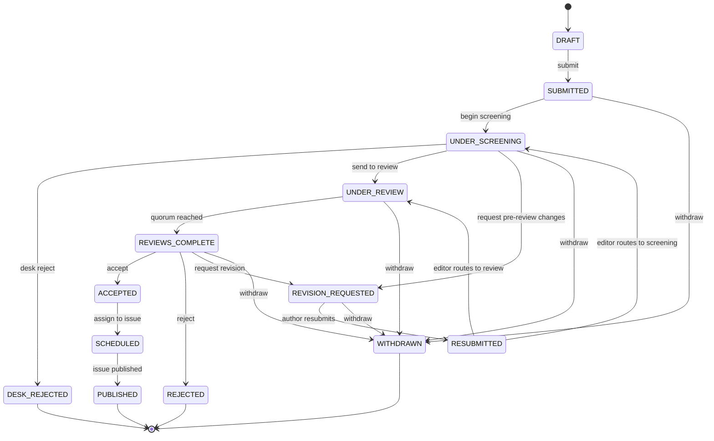
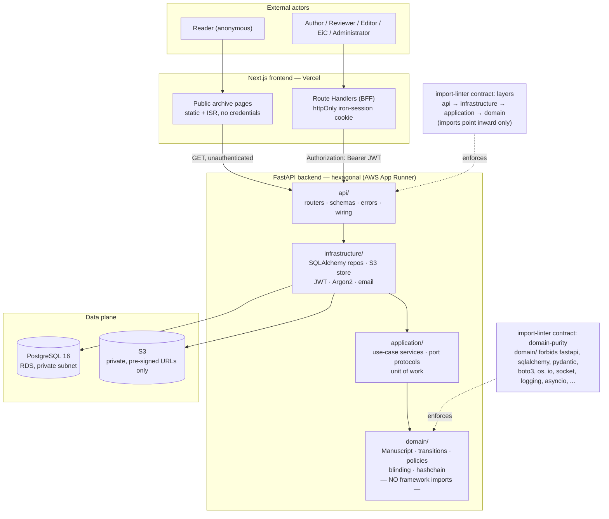
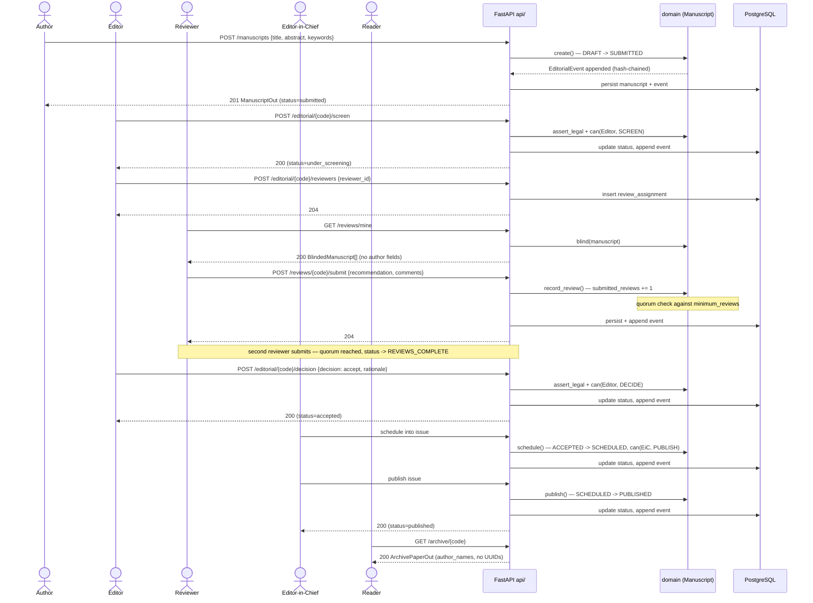
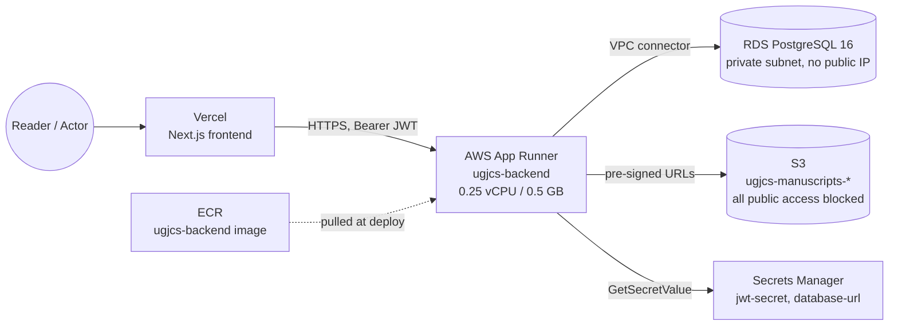

# UGJCS — Project Documentation

**Document:** 01 — Consolidated project documentation (main submission document)
**Author:** Roger Koranteng Obeng, student ID 22424140
**Assessor:** Prof. Solomon Mensah
**Course:** Advanced Software Engineering — individual capstone
**Date:** 2026-08-12
**Live system:** `https://ugjcs-frontend.vercel.app` · API `https://tsxsbf9rzp.us-east-1.awsapprunner.com`
**Repository:** `github.com/rogerkorantenng/ugjcs`
**Submitted as:** `Project_Documentation.pdf`

**Status of this document.** This is a consolidating document. It summarises and
cross-references six authoritative supporting documents and the codebase itself rather than
duplicating them; where a figure, table, or claim has a fuller treatment elsewhere, that
document is named and the reader is pointed to it. Nothing here should be taken to override
what those documents say — where a discrepancy exists between two of them, it is recorded
rather than silently resolved in one direction (see §10.4).

**Referenced source documents**

| # | Document | Role |
|---|---|---|
| 02 | `docs/02-srs.md` | Software Requirements Specification, traceability matrix |
| 03 | `docs/03-effort-estimation.md` | Use Case Points, COCOMO II cross-check, MoSCoW cut |
| 04 | `docs/04-technical-debt-register.md` | Fourteen debt entries, Debt→Cause→Impact→Priority→Resolution |
| 05 | `docs/05-api-contract.md` | HTTP boundary contract between backend and frontend |
| 06 | `docs/06-testing-report.md` | Test strategy, test cases, defects found, UAT |
| — | `docs/superpowers/specs/2026-08-12-ugjcs-journal-platform-design.md` | Design specification (problem, architecture, data model) |
| — | `backend/src/ugjcs/domain/` | The implemented domain — source of truth for lifecycle and rules |
| — | `infra/` | Terraform — source of truth for the deployed topology |

---

## 1. Project title

**UGJCS — University of Ghana Journal of Computing Science**, a double-blind peer-reviewed
journal management platform built as an individual Advanced Software Engineering capstone
within a 48-hour development window.

---

## 2. Problem statement

The Department of Computer Science, University of Ghana has no dedicated system for managing
scholarly publication. Where departmental or faculty journals exist in the Ghanaian university
context, the editorial process is typically conducted over email and shared spreadsheets. That
approach fails in four specific ways (design specification §1):

1. **Blinding is not enforceable.** Double-blind review depends on a human remembering to strip
   identifying information from a document before forwarding it. Author names routinely survive
   in PDF metadata even when removed from the visible text.
2. **There is no audit trail.** When a rejected author appeals, there is no authoritative,
   tamper-evident record of who decided what, when, and on what evidence.
3. **Reviewer assignment is ad hoc.** Editors assign from memory, which concentrates load on a
   few willing reviewers and misses expertise matches entirely.
4. **Published work is not discoverable.** Accepted papers end up as files on a shared drive
   rather than in a citable, indexable, harvestable archive.

UGJCS addresses all four as first-class system responsibilities — enforced by the system —
rather than as procedural guidance that depends on a human remembering to follow it.

---

## 3. Aim and objectives

**Aim.** Deliver a deployed, production-quality platform that manages the complete scholarly
publishing lifecycle from submission to public archival, with double-blind integrity and
editorial auditability enforced by the system rather than by convention.

**Objectives:**

- **O1.** Enforce a guarded manuscript lifecycle in which no illegal state transition is
  reachable through any interface.
- **O2.** Guarantee double-blind integrity structurally, including at the document level.
- **O3.** Provide a tamper-evident editorial audit trail.
- **O4.** Assist reviewer assignment with expertise matching, conflict-of-interest exclusion and
  workload balancing, leaving final authority with the editor.
- **O5.** Publish accepted work to a public, searchable, citable and machine-harvestable
  archive.
- **O6.** Demonstrate disciplined engineering practice: estimation-driven scope, automated
  quality gates, infrastructure as code, and an explicit technical debt register.

Objectives O1–O3 are demonstrably met by the delivered domain layer (§8, §10); O4 is partially
met (reviewer assignment is a persistence record without matching or a conflict check — TD-02,
TD-03); O5 is met for the archive read path; O6 is the subject of §7, §11 and §12, and is, on
the evidence in §11.7, the objective this project delivers most convincingly.

---

## 4. Stakeholders

| Actor | Type | Primary concerns |
|---|---|---|
| Author | Primary, authenticated | Submit work, track progress, respond to reviews |
| Reviewer | Primary, authenticated | Accept/decline invitations, submit structured reviews, remain anonymous |
| Editor | Primary, authenticated | Screen submissions, assign reviewers, record decisions |
| Editor-in-Chief | Primary, authenticated | Compose issues, publish, configure journal policy, final authority |
| Administrator | Secondary, authenticated | User accounts, role assignment, reviewer capacity |
| Reader | Primary, anonymous | Discover, read, cite and download published papers |
| Head of Department | Secondary | Editorial throughput and workload analytics |
| Indexing services | External system | Harvest metadata via OAI-PMH |

Non-human stakeholders: the AWS platform (cost and operability, §13) and future maintainers,
for whom the technical debt register (§12) is written.

A single account may hold multiple roles simultaneously — a deliberate design choice (design
specification §3, SRS §2.3) with a direct security consequence: the authorisation layer does
not currently prevent an Author–Reviewer dual-role holder from reviewing their own manuscript
(TD-02, §12).

---

## 5. Requirements analysis

Requirements were elicited from the problem statement (§2) rather than from a real client, since
no departmental submissions or reviewer data are available (SRS §2.6) — a stated constraint, not
a hidden one. The analysis proceeded in four steps, each of which left an artefact this
consolidation points to rather than repeats:

1. **Actor and use-case inventory.** Eight stakeholder classes (§4) were mapped to 25 use cases
   spanning identity, submission, screening, review, decision, publication, archive and
   administration (effort estimation §3; SRS §4.2).
2. **Functional requirements, stated testably.** Each of 28 functional requirements (plus one,
   FR-25a, added during this analysis — see below) is written as "the system shall …", with
   explicit preconditions, postconditions and an acceptance criterion, following IEEE 830-1998
   and ISO/IEC/IEEE 29148:2018 (SRS §1.1, §3.1).
3. **Non-functional requirements, each with a verification method.** Seventeen NFRs across
   security, integrity, performance, reliability, availability, usability, maintainability,
   observability, portability and compliance, each naming the test or check that verifies it
   (SRS §3.2) — "non-functional" is deliberately not allowed to mean "unverifiable."
4. **Prioritisation against an effort estimate, not against intuition.** MoSCoW priorities were
   assigned per requirement in the design specification (§5) and made authoritative once the
   effort estimate (§7 below) confirmed the full system was roughly two orders of magnitude
   larger than the 48-hour window — the cut was a consequence of measurement, not a guess made
   in parallel with it.

**A requirement discovered during analysis, not invented for the report.** Comparing the
implemented lifecycle guard (`transitions.py`, which permits `WITHDRAWN` as a target state) against
the implemented authorisation layer (`policies.py`, which has no action gating who may invoke
it) surfaced a live authorisation gap the original FR-25 did not anticipate. This was recorded as
**FR-25a**, marked NEW, rather than silently patched — a demonstration that requirements analysis
did not stop once the SRS was signed off (SRS §3.1, Group E).

The full requirement set, with preconditions, postconditions and acceptance criteria, is in
`docs/02-srs.md` §3; this section summarises the *process*, that document contains the *content*.

---

## 6. Software Requirements Specification (SRS)

The authoritative SRS is `docs/02-srs.md`, conformant to IEEE 830-1998 and ISO/IEC/IEEE
29148:2018. It is structured in seven sections: introduction and scope (§1), overall
description and operating environment (§2), specific functional and non-functional
requirements (§3), system models — lifecycle, actor mapping, authorisation matrix (§4), the
requirements traceability matrix (§5), MoSCoW prioritisation (§6), and constraints/limitations
(§7). This section summarises its content and states plainly where it is now stale relative to
the delivered system (§10.4).

### 6.1 Requirement counts

| Category | Count | Priority split |
|---|---|---|
| Functional requirements | 28 (FR-01…FR-28) + FR-25a (new) | 18 Must, 7 Should, 3 Could |
| Non-functional requirements | 17 (NFR-01…NFR-17) | Security (6), Integrity (1), Performance (2), Reliability (1), Availability (1), Usability (1), Maintainability (2), Observability (1), Portability (1), Compliance (1) |

### 6.2 The manuscript lifecycle is the SRS's executable core

SRS §4.1 transcribes the lifecycle directly from `backend/src/ugjcs/domain/transitions.py`'s
`LEGAL_TRANSITIONS` mapping — stated explicitly as the tested source of truth, not the narrative
diagram in the design specification. The full state table and diagram are reproduced and
explained in §8.2 of this document, since the lifecycle is equally central to system analysis.

### 6.3 A recorded, load-bearing disagreement between two authoritative documents

SRS §4.1.3 records that the design specification's own lifecycle diagram (§6.2 of that document)
draws `RESUBMITTED` flowing directly into `REVIEWS_COMPLETE`, implying a resubmission
automatically closes the review round. The implemented `LEGAL_TRANSITIONS` table instead routes
`RESUBMITTED` to **either** `UNDER_REVIEW` **or** `UNDER_SCREENING`, at editorial discretion,
and never closes the round by itself. Per this project's stated rule — the implementation
governs, and the disagreement is recorded rather than hidden — the SRS and this document both
follow the code.

### 6.4 Traceability matrix — read honestly, not optimistically

SRS §5 states plainly that, as written, most functional requirements are recorded as "Planned"
rather than "Implemented," because the SRS was authored early, against only the domain layer and
the database persistence adapter. **This is now stale**: the delivered codebase includes a
complete `api/` layer (routers for auth, manuscripts, editorial, reviews, archive — §10.2) and a
full Next.js frontend, neither of which existed when SRS §5 was written. `docs/05-api-contract.md`
and `docs/06-testing-report.md` are the current authorities on what is actually reachable by
route; §10.4 of this document reconciles the three. The SRS's traceability *method* — status
categories tied to a named module and test, not to a claim of completeness — remains sound and is
the right lens through which to read §10 of this document.

### 6.5 Authorisation matrix — the register's origin point

SRS §4.3 derives the authorisation matrix directly from `policies.py`'s `_ROLE_GRANTS` and
`_OWNERSHIP_ACTIONS`, and names the two critical gaps that became TD-02 and TD-03 (§12) before
the technical debt register existed as a separate document — the SRS is where those gaps were
first written down.

---

## 7. Software effort estimation

Full arithmetic, every intermediate figure, and the estimation method are in
`docs/03-effort-estimation.md`. This section summarises the method, the headline figures and
why they matter, without repeating the derivation.

### 7.1 Method

**Use Case Points (UCP)** is the primary technique — actor and use-case weights are read
directly off the functional requirements table rather than guessed. **COCOMO II Early Design**
serves as an independent cross-check on different inputs (source lines of code, process/product
ratings) rather than actor/transaction counts. Agreement between two methods driven by different
inputs is stronger evidence than precision from either alone.

### 7.2 Headline figures

| Quantity | Value | Basis |
|---|---|---|
| Unadjusted actor weight (UAW) | 19 | 6 GUI actors × 3 + 1 API actor × 1 |
| Unadjusted use-case weight (UUCW) | 225 | 25 use cases, Karner transaction-count classes |
| UUCP | 244 | UAW + UUCW |
| Technical complexity factor (TCF) | 1.105 | 13 technical factors, ΣT = 50.5 |
| Environmental complexity factor (ECF) | 0.605 | 8 environmental factors, ΣE = 26.5 |
| **UCP (full system)** | **163.1** | UUCP × TCF × ECF |
| **Effort, full system** | **≈ 3,262 person-hours** (≈ 1.8 person-years) | UCP × PF (20 h/UCP) |
| **UCP (Must-have subset, UC1–UC18)** | **125.7** | Same method, 18 use cases only |
| **Effort, Must-have subset** | **≈ 2,514 person-hours** | UCP × 20 |
| COCOMO II Early Design (full system) | ≈ 7,170 person-hours (47.2 person-months) | 12 KSLOC, ΣSF = 14.36, ∏EM = 1.1699 |

`PF = 20 h/UCP` follows Karner's productivity-factor rule: the count of E1–E6 rated below 3, plus
the count of E7–E8 rated above 3, sums to 0 here — within the ≤2 threshold for PF = 20, not a
default assumption (effort estimation §6).

### 7.3 Reconciliation, not convergence

The two methods differ by roughly 2.2× (7,170 ÷ 3,262). This is explained, not dismissed: COCOMO
II is calibrated on projects carrying formal verification and management overhead this project
does not incur, and its `SCED` (schedule-compression) penalty compounds multiplicatively with
`RCPX` and `PDIF` for an extreme-compression solo project. UCP, conversely, counts only
externally visible actor transactions and is structurally blind to platform work — Terraform,
CI/CD, the hash chain's internals — of which this project has a disproportionate amount relative
to its use-case count. The two methods **bound the answer from the same side**: both place the
full system in the one-to-four-person-year range, nearly two orders of magnitude beyond the
48-hour window. That agreement on *scale*, not either figure's precision, is what forces the
MoSCoW cut.

### 7.4 The MoSCoW cut this estimate produced

| Priority | Use cases | Decision |
|---|---|---|
| Must | UC1–UC18 | Implemented to production quality |
| Should | UC19–UC23 | Implemented only if Must-have work completed early |
| Could | UC24, UC25 | Deferred; entered in the technical debt register |

### 7.5 Why the realised effort does not invalidate the estimate

The Must-have estimate of 2,514 person-hours assumes Karner's PF = 20 h/UCP, calibrated on manual
development. This build used AI-assisted development — Claude Code (Anthropic) pair-programming
the implementation under the author's direction and review — which the estimation document
treats as a change of development **method**, not merely of pace (effort estimation §9). Three
consequences follow, and each is load-bearing for how this document's conclusion (§18) should be
read:

1. **UCP still correctly sized the problem.** What changes under AI assistance is the rate at
   which a chosen method converts problem-size into elapsed hours (the productivity factor), not
   the size of the problem itself. The MoSCoW cut in §7.4 was decided before the realised
   productivity was known, and remains the correct basis for it.
2. **The realised productivity factor is a local calibration, not a general claim** — evidence
   about this developer, this tool, this domain and this window, computed formally by the method
   in effort estimation §10.3 (actual session-hours from commit history ÷ delivered UCP). It does
   not generalise to other developers or tools.
3. **The gap between estimated and realised hours is not free capacity.** It is capacity that was
   not spent on activities the classical estimate priced in: test depth beyond the 85% coverage
   floor, architecture decision records and onboarding documentation, and security hardening
   beyond the NFR-01–NFR-06 baseline. This connects directly to the limitations recorded in §17.

---

## 8. System analysis

This section and §9 are original to this consolidation. §8 analyses the problem domain as
modelled — the aggregates, the manuscript lifecycle as a state machine, the double-blind
projection, the audit mechanism's design rationale, and the persisted data model. §9 covers the
architectural design decisions that realise that analysis — the hexagonal layering, its two
mechanically enforced contracts, the API design, and the deployment topology.

### 8.1 Domain model

`Manuscript` is the aggregate root; it owns its authorship, status, version and review count, and
nothing outside the aggregate mutates them directly. `User` (implemented as `Account` in code —
`domain/account.py`), `Issue` and the editorial event log are separate aggregates referenced by
identity. Value objects (`domain/ids.py`) give every identifier — `TrackingCode`,
`ManuscriptId`, `UserId` — its own type rather than a bare `UUID` or `str`, so a tracking code and
a user id cannot be interchanged by a type error that would otherwise compile.

The eight domain modules and their responsibilities:

| Module | Responsibility |
|---|---|
| `manuscript.py` | The `Manuscript` aggregate: lifecycle transitions, review-quorum counting, resubmission versioning |
| `transitions.py` | `LEGAL_TRANSITIONS` — the exhaustive state table and `assert_legal` guard |
| `policies.py` | `can(actor, action, resource)` — role-based and ownership-based authorisation, deny by default |
| `blinding.py` | `blind()` — the structural double-blind projection (§8.4) |
| `hashchain.py` | `append`/`verify` — the tamper-evident audit chain (§8.5) |
| `events.py` | `EditorialEvent` — the audit record's canonical, hashable representation |
| `account.py` | `Account` aggregate: identity, roles, credentials (role vocabulary only — no registration flow in the domain layer) |
| `enums.py`, `ids.py`, `errors.py` | Shared vocabulary, typed identifiers, the `DomainError` hierarchy |

### 8.2 The manuscript lifecycle as a state machine

The lifecycle below is transcribed from `transitions.py`'s `LEGAL_TRANSITIONS` mapping — the
executable, tested source of truth (SRS §4.1), reproduced here because it is the single most
important artefact in the system's analysis.

| Source state | Legal targets | Terminal? |
|---|---|---|
| `DRAFT` | `SUBMITTED` | No |
| `SUBMITTED` | `UNDER_SCREENING`, `WITHDRAWN` | No |
| `UNDER_SCREENING` | `DESK_REJECTED`, `UNDER_REVIEW`, `REVISION_REQUESTED`, `WITHDRAWN` | No |
| `UNDER_REVIEW` | `REVIEWS_COMPLETE`, `WITHDRAWN` | No |
| `REVIEWS_COMPLETE` | `ACCEPTED`, `REJECTED`, `REVISION_REQUESTED`, `WITHDRAWN` | No |
| `REVISION_REQUESTED` | `RESUBMITTED`, `WITHDRAWN` | No |
| `RESUBMITTED` | `UNDER_REVIEW`, `UNDER_SCREENING` | No |
| `ACCEPTED` | `SCHEDULED` | No |
| `SCHEDULED` | `PUBLISHED` | No |
| `DESK_REJECTED`, `REJECTED`, `PUBLISHED`, `WITHDRAWN` | *(none)* | **Yes** |



No transition is legal out of a terminal state — `assert_legal` raises `IllegalTransitionError`
for any pair absent from `LEGAL_TRANSITIONS`, checked exhaustively over all 121 (source × target)
status pairs by a property test (`test_lifecycle_permits_expected_transitions`,
`test_lifecycle_forbids_shortcut_transitions`, testing report §3.1–§3.2). `ACCEPTED` and
`SCHEDULED` are deliberately excluded from the withdrawable set: retracting an accepted paper is
editorial retraction, with its own notice obligations, and is not modelled as author withdrawal.

### 8.3 Authorisation as an explicit relation, not scattered checks

`policies.can(actor, action, resource)` is a single function computing every access decision in
the system, called as a FastAPI dependency so no route can omit it (§9.3). It composes two kinds
of rule: `_ROLE_GRANTS` (an action is available to any actor holding a given role — e.g. `SCREEN`
requires `editor` or `editor_in_chief`) and `_OWNERSHIP_ACTIONS` (an action additionally requires
the actor's identity to match a predicate over the resource — e.g. `RESUBMIT` and `WITHDRAW`
require the actor to be the manuscript's corresponding author). Two of this matrix's known gaps
— `REVIEW` granted on role alone with no ownership predicate excluding an author reviewing their
own work — are TD-02 and TD-03 (§12); they are gaps in the *matrix*, found by asking whether every
action that should be ownership-checked is, not gaps in the mechanism that enforces it.

### 8.4 Double-blind integrity as a projection, not a filter

The core design decision: blinding is **structural**, not procedural. `blind(manuscript)`
(`blinding.py`) does not filter a full `Manuscript` object and hope every caller remembers to
call it — it returns a distinct type, `BlindedManuscript`, that has no author-identifying field
at all:

```python
@dataclass(frozen=True, slots=True)
class BlindedManuscript:
    tracking_code: str
    title: str
    abstract: str
    keywords: tuple[str, ...]
    version: int
    status: str
```

There is no field a future change could accidentally repopulate with an author id, because the
type has nowhere to put one. This is verified by a property test asserting the author id is
absent from the serialised projection for every generated title/abstract/keyword combination
(testing report §3.2), and by sentinel-based leak tests over every reviewer-facing endpoint
(testing report §3.5). The documented limit — `title`, `abstract` and `keywords` are copied
**verbatim**, so self-identifying text in the body is not scrubbed — is TD-05 and is restated in
§17.

### 8.5 The hash-chained audit log

Each `EditorialEvent` records its sequence number, type, payload, actor, timestamp, its
predecessor's hash, and its own SHA-256 digest over `previous_hash ‖ canonical_bytes(event)`:

```python
def chain_hash(event: EditorialEvent, previous_hash: str) -> str:
    digest = hashlib.sha256()
    digest.update(previous_hash.encode("ascii"))
    digest.update(event.canonical_bytes())
    return digest.hexdigest()
```

`append` links a new event onto a chain tail in O(1) — it reads only the last link, not the whole
history (TD-08 records that this capability is unverified by a dedicated test). `verify` walks
the chain from the genesis hash (`"0" × 64`) and raises `ChainBrokenError` at the first
inconsistency in sequence, predecessor hash, or digest. This detects **alteration, reordering and
removal within the chain** — it is deliberately, and explicitly in the module's own docstring,
**not** a defence against tail truncation, a forged event appended through the legitimate API, or
a wholly rebuilt history from genesis: all three require an external anchor the domain layer does
not provide (TD-04, restated in §17). A PostgreSQL trigger closes the most direct way to defeat
this at the database layer for `UPDATE`/`DELETE`; a second, statement-level trigger closes
`TRUNCATE`, which the first trigger did not — see §11.4's account of how that gap was found.

### 8.6 Data model — entity-relationship diagram

The tables below are the delivered PostgreSQL schema (`backend/src/ugjcs/infrastructure/db/models.py`),
not the fuller schema sketched in the design specification (§8 of that document) — `reviews`,
`editorial_decisions`, `issues`, `issue_papers`, `similarity_reports`, `notifications` and a
dedicated roles table are specified there but not present in the delivered database; roles are a
`user_roles` join table, and the review outcome is folded into `review_assignments`.

```mermaid
erDiagram
    USERS ||--o{ USER_ROLES : "has"
    USERS ||--o{ REFRESH_TOKENS : "issues"
    MANUSCRIPTS ||--o{ MANUSCRIPT_AUTHORS : "has"
    MANUSCRIPTS ||--o{ EDITORIAL_EVENTS : "audit trail"
    MANUSCRIPTS ||--o{ REVIEW_ASSIGNMENTS : "has"

    USERS {
        uuid id PK
        string email UK
        string password_hash
        string full_name
        string affiliation
        text_array expertise
        int reviewer_capacity
        bool is_verified
        bool is_active
    }
    USER_ROLES {
        uuid user_id PK_FK
        string role PK
    }
    REFRESH_TOKENS {
        uuid id PK
        uuid user_id FK
        uuid family_id
        string token_hash UK
        timestamptz issued_at
        timestamptz expires_at
        timestamptz revoked_at
        uuid replaced_by
    }
    MANUSCRIPTS {
        uuid id PK
        string tracking_code UK
        text title
        text abstract
        text_array keywords
        uuid corresponding_author_id
        string status
        int version
        int minimum_reviews
        int submitted_reviews
        uuid issue_id
        string original_document_key
        string anonymised_document_key
    }
    MANUSCRIPT_AUTHORS {
        uuid manuscript_id PK_FK
        uuid author_id PK
        int position
    }
    REVIEW_ASSIGNMENTS {
        uuid id PK
        uuid manuscript_id FK
        uuid reviewer_id
        string status
        string recommendation
        text comments
        timestamptz assigned_at
        timestamptz submitted_at
    }
    EDITORIAL_EVENTS {
        uuid manuscript_id PK_FK
        int sequence PK
        string event_type
        json payload
        uuid actor_id
        timestamptz occurred_at
        string previous_hash
        string event_hash
    }
```

**A design note worth stating rather than glossing over:** `manuscript_authors.author_id` and
`review_assignments.reviewer_id` are plain `UUID` columns, not declared foreign keys to `users.id`
— referential integrity between authorship/reviewer assignment and the user table is an
application-level guarantee, not a database-enforced one. `editorial_events.manuscript_id` *is* a
declared foreign key with `ON DELETE RESTRICT`, so a manuscript with audit events cannot be
deleted (verified: testing report §3.3). `editorial_events` carries a unique constraint on
`(manuscript_id, event_hash)` and no application code path issues `UPDATE` or `DELETE` against it;
the database-level enforcement of that is described in §8.5 and §11.4.

---

## 9. System design

### 9.1 Architecture — hexagonal, backend

```
backend/src/ugjcs/
├── domain/          entities, value objects, events, state machine, policies
│                    NO framework imports (enforced by import-linter, §9.2)
├── application/     use-case services, port protocols, DTOs, unit of work
├── infrastructure/  SQLAlchemy repositories, S3 storage, JWT, Argon2, email
└── api/             FastAPI routers, request/response schemas, dependencies, wiring
```

Dependencies point inwards only. Concrete adapters (SQLAlchemy repositories, the S3 document
store, JWT token service) implement port *protocols* declared in `application/ports.py` and are
bound to them at a composition root (`api/wiring.py`), so the application and domain layers never
import a concrete adapter. The payoff is directly demonstrable, not asserted: the entire domain
test suite runs with no database, no network and no framework loaded (testing report §1).



### 9.2 The two import-linter contracts, and why they are mechanical rather than aspirational

`.importlinter` at the backend root defines two contracts, both run as a CI gate in `make check`
(testing report §2):

- **`layers`** — `ugjcs.api → ugjcs.infrastructure → ugjcs.application → ugjcs.domain`. A layer may
  import only the layers named after it in this list; an import running the other way fails the
  build. This is what makes "dependencies point inwards" a property CI checks on every commit,
  not a convention a reviewer might miss.
- **`domain-purity`** — forbids `ugjcs.domain` from importing `fastapi`, `sqlalchemy`, `pydantic`,
  `boto3`, `arq`, `redis`, `httpx`, `requests`, and thirteen standard-library I/O/framework
  modules including `os`, `io`, `socket`, `logging`, `asyncio` and `subprocess`. A domain module
  that reaches for a timestamp via `datetime.now()` is permitted; one that reaches for a file, a
  socket, or a framework decorator is not, and the build fails before a test even runs.

Both contracts are a direct, testable realisation of NFR-13 ("the domain layer imports no
framework code") — the requirement is not merely documented, it is enforced the same way a type
error is: at build time, unconditionally.

### 9.3 API design

The HTTP boundary is documented exhaustively in `docs/05-api-contract.md`; this section states
its governing design decisions rather than repeating the endpoint table.

- **Bearer-token backend, cookie-sessioned frontend.** The FastAPI backend is a pure bearer-token
  API — short-lived JWT access tokens (`HS256`) plus rotating, hash-stored refresh tokens. The
  Next.js frontend is a Backend-For-Frontend: Route Handlers under `frontend/src/app/api/**`
  unseal an httpOnly, Secure, `SameSite=Lax` cookie and attach the bearer token server-side. No
  browser-side JavaScript ever holds a token. This exists specifically to avoid third-party
  cookie blocking between the `*.vercel.app` and `*.awsapprunner.com` origins (design
  specification §7.2).
- **Errors as RFC 9457 Problem Details**, uniformly, from every endpoint — `{type, title,
  status, detail?, instance?}` served as `application/problem+json`, with a fixed exception→status
  mapping (`IllegalTransitionError→409`, `AuthorizationDeniedError→403`, etc.) so the frontend
  branches on structure, not on parsing a message string.
- **snake_case on the wire, unconditionally.** No camelCase translation layer exists anywhere;
  `ugjcs.domain.enums` values are copied verbatim into the frontend's TypeScript types. This was a
  considered choice, recorded as such in the API contract, not an oversight.
- **No pagination anywhere.** A deliberate scope decision for a demonstration-scale corpus,
  recorded so that adding it later is understood as an additive change, not a redesign.
- **Authorisation as a dependency, not a decorator convention.** Every route's `Action` is
  resolved through `policies.can()` as a FastAPI dependency, and `test_route_audit.py` walks the
  *live* route table asserting every non-public route carries one — a defect a hand-maintained
  checklist would eventually miss (testing report §1).

### 9.4 Sequence — submit to publish



This flow is exercised end to end by the acceptance script in testing report §5, and the
`schedule`/`publish` steps are the specific ones that were, for a period, implemented and
unit-tested but reachable by no route — the finding retold in §11.4 and cross-referenced from
§10.4.

### 9.5 Deployment topology

Covered fully in §13; the topology is a component of the design and is diagrammed there once
alongside its discrepancy from the design specification (TD-14) rather than twice.

---

## 10. Implementation

### 10.1 Technology stack

| Layer | Choice | Rationale (design specification §7.4) |
|---|---|---|
| Backend | FastAPI, Python 3.13 | Native async I/O; Pydantic v2 gives validation and OpenAPI from one type |
| ORM | SQLAlchemy 2.0 + Alembic | Mature migrations; mapping style keeps domain classes framework-free |
| Database | PostgreSQL 16 | Native full-text search and JSONB avoid a separate search engine |
| Storage | S3 | Durable, private, pre-signed access only |
| Frontend | Next.js 15, TypeScript, Tailwind | Static public pages plus a server-side BFF in one deployment |
| Testing | pytest, Hypothesis, testcontainers, Vitest | Layer-appropriate verification (§11) |
| IaC | Terraform | Reproducible, reviewable, destroyable |

### 10.2 What is implemented, by layer

**Domain** (`backend/src/ugjcs/domain/`, 812 lines across 11 modules) — complete: the manuscript
lifecycle, RBAC policy, the double-blind projection, the hash chain, the account aggregate,
typed identifiers. This is the layer with no external dependency and the highest test confidence
(§11).

**Application** (`backend/src/ugjcs/application/`, 487 lines) — port protocols (`ports.py`, 236
lines), identity-related use-case orchestration (`identity.py`, 186 lines) and document handling
(`documents.py`, 65 lines).

**Infrastructure** (`backend/src/ugjcs/infrastructure/`) — SQLAlchemy repositories and unit of
work (`infrastructure/db/`), an S3-backed document store with a demo-PDF generator for seeding
(`infrastructure/storage/`), Argon2 password hashing and JWT issuance
(`infrastructure/security/`), and a logging-only email sender
(`infrastructure/email/logging_sender.py` — no live transactional provider is wired in this
build, a limitation restated in §17).

**API** (`backend/src/ugjcs/api/`, 966 lines) — five routers (`auth`, `manuscripts`, `editorial`,
`reviews`, `archive`), RFC 9457 error mapping (`errors.py`), and the composition-root wiring
(`wiring.py`) that binds concrete adapters to the application's port protocols. This layer, and
the frontend below it, are what SRS §5 (written earlier in the project) records as "Planned" —
§10.4 reconciles that.

**Frontend** (`frontend/src/app/`) — a public route group (`(public)/search`, `(public)/papers`)
requiring no authentication, and role-scoped authenticated routes (`author/`, `author/submit/`,
`author/[trackingCode]/`, `editor/`, `editor/[trackingCode]/`, `reviewer/`,
`reviewer/[trackingCode]/`, `login/`), plus a `frontend/src/app/api/**` BFF layer mirroring the
backend's resource groups. There is no dedicated Administrator UI — role management is verified
only at the policy-test level (testing report §5, §6), consistent with FR-03's grant existing in
`policies.py` without a corresponding administration screen.

### 10.3 Domain code, as evidence rather than assertion

The lifecycle guard and the hash chain shown in §8.2 and §8.5 are reproduced directly from source,
not paraphrased, specifically so a reader can check this document's claims against the file it
names. The same discipline extends to the authorisation layer (§8.3) and the blinded projection
(§8.4): every mechanism described in this section has a named module, and every claim about its
behaviour is backed by a named test in `docs/06-testing-report.md`.

### 10.4 Reconciling three documents that were written at different points in the build

This consolidation surfaced a genuine discrepancy between three of its own source documents,
stated here rather than resolved silently in one direction, consistent with §6.3's handling of
the SRS-versus-specification lifecycle disagreement:

- **`docs/02-srs.md` §5** (earliest) records almost the entire functional requirement set as
  "Planned," on the stated grounds that no `api/` directory and no frontend existed in the
  repository at the time it was written.
- **`docs/05-api-contract.md`** (written once the API and frontend existed) documents a working
  `/auth`, `/manuscripts`, `/editorial`, `/reviews` and `/archive` surface — but explicitly states
  that `Action.PUBLISH`/`Manuscript.schedule`/`Manuscript.publish` have **no corresponding
  route**: "publication into the archive happens outside the HTTP boundary this plan builds."
- **`docs/06-testing-report.md` §3.4 and §4.5** (latest) records passing system tests named
  `test_the_editor_in_chief_can_schedule_an_accepted_manuscript` and
  `test_the_editor_in_chief_can_publish_a_scheduled_manuscript`, and states directly that these
  two routes, along with manuscript resubmission, were **added after** being found reachable by no
  route during manual use of the deployed system.

Read together rather than in isolation, these three documents describe the same system at three
successive points in its build, not three inconsistent descriptions of one static state: the SRS
predates the API layer; the API contract predates the schedule/publish routes; the testing report
postdates their addition and is the most current account of what the deployed system can do. This
document treats the testing report as authoritative on current reachability, the API contract as
authoritative on wire format for the routes it does describe, and the SRS as authoritative on
requirement *content and traceability method* rather than current build status. A reader
integrating all three should not conclude either that publication is unreachable (05, superseded)
or that the majority of FRs remain unbuilt (02 §5, superseded) — §11.4's account of finding and
closing that exact gap is the more current and more informative story.

---

## 11. Testing

Full test-case tables, defect narratives and the UAT script are in
`docs/06-testing-report.md`. This section summarises the strategy, headline numbers, and the
finding this project treats as its most important methodological result (§11.7, elaborated for
the whole document in the introduction's through-line).

### 11.1 Strategy — layered to match the architecture

| Layer | What it tests | Tooling |
|---|---|---|
| Unit — domain | Pure logic, no database/HTTP/mocks | pytest |
| Property-based | Invariants over generated inputs (lifecycle, hash chain, blinding) | Hypothesis |
| Unit — application/API/db/security | Adapter logic in isolation | pytest, fakes |
| Integration | Real PostgreSQL via `testcontainers` — trigger firing, `timestamptz` normalisation, FK behaviour | pytest, testcontainers |
| Contract | Architectural rules, not behaviour | import-linter, `mypy --strict` |
| Route audit | Every non-public route carries an authorisation dependency | pytest walking the live route table |
| End-to-end / manual acceptance | Scripted, role-scoped scenarios against the **live deployment** | Playwright-driven browser session |

### 11.2 Headline numbers (2026-08-12, from `make check` / `make integration`)

```
make check       → 267 passed, 56 deselected. Coverage: 88.24% (gate: 85%)
make integration → 56 passed, 267 deselected. Infrastructure coverage: 87%
```

323 backend tests total. Frontend: 10 Vitest files, 17 `it(...)` cases (asserted by reading the
files directly; the report could not execute `npm test` in its authoring environment — stated
plainly rather than estimated). Coverage is gated only on `domain` and `application` — a
documented decision, not an oversight: measuring infrastructure coverage in a run that has
excluded infrastructure tests would credit incidental coverage, not genuine exercise.

### 11.3 CI gates

`.github/workflows/backend-ci.yml` runs two jobs on every push/PR to `main`/`master`: **`check`**
(ruff lint, ruff format, mypy strict, import-linter, unit suite at the 85% gate) and
**`integration`** (a real `postgres:16` service container, Alembic migration applied **up, then
down, then up again** to verify reversibility, then the integration suite). Neither job passing
is optional for merge.

### 11.4 Defects found — the section with the most to learn from

Six defects are recorded in testing report §4, none found by a coverage number or a green test
run alone:

| # | Defect | Found by |
|---|---|---|
| 1 | Deleting the hash chain's chaining line left **all tests passing** at 100% coverage | Manual mutation testing |
| 2 | `canonical_bytes()` hashed a UTC-offset-bearing timestamp; PostgreSQL normalises offsets on storage, so a round trip would false-positive `verify()` as tampered | Reasoning about the storage boundary, not any test |
| 3 | A row-level trigger blocked `UPDATE`/`DELETE` on the audit log but PostgreSQL never fires row-level triggers on `TRUNCATE` — one statement erased the log with no error | Asking a broader question of an already-verified control |
| 4 | coverage.py does not model a ternary as a two-arm branch — "0 branches missing" while one arm never ran | Reading logic against the coverage report, not trusting it |
| 5 | Three domain lifecycle methods (`resubmit`, `schedule`, `publish`) were fully implemented and unit-tested but reachable by no API route | The owner using the deployed system as an actual actor would |
| 6 | A container held IAM permission to reach S3 but no network route to it — uploads hung until the health check killed the instance | Exercising the deployed upload feature against real infrastructure |

Defects 1–4 were found by review of code that had already passed linting, strict typing, an
architecture contract and a 100%-covered test suite; defects 5–6 were found only by using the
running system. This is the single clearest piece of evidence this project produced about
software engineering practice, and it is why the technical debt register (§12) and this report
both state it directly rather than let it sit implicit in a defect table.

### 11.5 User acceptance testing

Run as scripted, role-scoped scenarios against the live deployment
(`https://ugjcs-frontend.vercel.app`, backed by `https://tsxsbf9rzp.us-east-1.awsapprunner.com`),
with five named judge accounts (author, reviewer, editor, editor-in-chief, administrator — see
§14). Three scenarios were exercised live for the testing report (author login and dashboard,
unauthenticated archive access, cross-role access denial redirecting to `/` rather than `/login`
— a deliberate distinction in `frontend/middleware.ts`); the remaining role-scoped scenarios are
documented against their automated backstop test.

### 11.6 What testing did not cover

Stated plainly in testing report §6, not omitted: no load or performance testing (NFR-08/NFR-09
are unverified against the running system); no automated security scanning in CI (no SAST, DAST
or dependency vulnerability scan); no mutation testing in CI (§11.4's finding #1 was a one-off
manual pass); no browser-matrix testing (one Chromium-based session only); no committed automated
end-to-end suite (`@playwright/test` is a declared dependency with no spec files committed). Each
is restated as a limitation in §17.

### 11.7 Evaluation

The testing report's own conclusion, reached independently from the test evidence, matches the
technical debt register's closing observation exactly: **automated gates establish a floor and
catch regressions; they did not find the defects that mattered most.** Every serious defect was
found by a human or an agent reading code against what it claimed to do, by mutation testing
designed specifically to distrust the coverage figure, or by using the running system as an
actual actor would. This is elaborated once, fully, in §12.6, since the two documents converge on
one finding rather than two.

---

## 12. Technical debt

The full register — fourteen entries, each with Debt → Cause → Impact → Priority → Proposed
resolution — is `docs/04-technical-debt-register.md`. This section summarises it by priority and
draws out its methodological finding.

### 12.1 Summary

| Priority | Count | Entries |
|---|---|---|
| Critical | 3 | TD-01, TD-02, TD-03 |
| Scheduled | 6 | TD-04, TD-05, TD-06, TD-07, TD-08, TD-14 |
| Acceptable | 3 | TD-09, TD-10, TD-11 |
| Resolved, retained as a record | 2 | TD-12, TD-13 |

### 12.2 Critical — must be resolved before real users

| ID | Debt | Impact |
|---|---|---|
| TD-01 | AWS access uses root account credentials | Cannot be scoped, rotated, or revoked without disrupting the whole account; compromise is unrecoverable within it. Mitigated: root keys are used only from the developer's workstation, never stored as a CI secret |
| TD-02 | `Action.REVIEW` is granted on the `REVIEWER` role alone, with no per-manuscript predicate | An Author–Reviewer dual-role holder is not prevented from reviewing their own work — the central conflict-of-interest failure for a double-blind journal |
| TD-03 | Submitted reviews are counted, not identity-checked against an accepted assignment | One reviewer calling submit twice reaches quorum alone and can close a review round unilaterally |

### 12.3 Scheduled — accepted now, with a named repayment point

| ID | Debt | Repayment point |
|---|---|---|
| TD-04 | The audit chain has no external anchor — tail truncation is undetectable by the application alone | Next release after deployment |
| TD-05 | Blinding does not scrub the manuscript body — `title`/`abstract`/`keywords` are verbatim | Screening surfaces name matches to the editor; automated redaction is future evolution, not near-term |
| TD-06 | The editorial event log has no blinded projection (`actor_id`, rationale text carried in full) | Before any reviewer-facing audit view is built |
| TD-07 | No `Action` connects `blind()` to `policies.can()` — an adapter must remember to call it | Alongside TD-02 |
| TD-08 | The tail-append capability (§8.5) is unverified by a dedicated test | With the persistence work that first exploits it |
| TD-14 | Deployed infrastructure is App Runner, not the ECS/ALB/CloudFront topology specified | After submission — repayable once the pre-submission document/feature backlog is clear (§13.3) |

### 12.4 Acceptable — a conscious, revisitable trade-off

| ID | Debt | Condition that would change the judgement |
|---|---|---|
| TD-09 | A hybrid event log (materialised status + append-only log) rather than full event sourcing | If projections multiply beyond one, or replay-to-a-past-state becomes a requirement |
| TD-10 | The coverage gate sits at 85% while the code delivers 88–100% | Cheap to raise; deliberately not set to the exact current figure so a legitimate refactor doesn't fail the build |
| TD-11 | Coverage is a weak signal — the register's own evidence (§12.6) | Compensated by mutation testing and review, not by the gate alone |

### 12.5 Resolved, retained as a record

TD-12 (a UTC-offset timestamp representation would have produced a false tamper alert) and TD-13
(`TRUNCATE` bypassed the row-level append-only trigger) are both closed, but kept in the register
rather than deleted, because the *class* of defect — and how each was found — is the point (§12.6,
§11.4).

### 12.6 The register's own conclusion, and this document's central finding

`docs/04-technical-debt-register.md` closes with a statement worth repeating verbatim in spirit
rather than only citing: **ten of its fourteen entries, and every serious defect in
`docs/06-testing-report.md` §4, were found by independent review of code that had already passed
every automated gate available in this project — linting, strict type checking, an architecture
contract, and a full test suite at 100% coverage — or by a person using the running system.**
Mutation testing showed the hash chain was, for a period, unprotected by any test that would
notice its defining property being deleted. `TRUNCATE` bypassed a trigger that had been "confirmed
firing against a live database" against the two statement types someone thought to check.
Three lifecycle methods were implemented, unit-tested, type-checked and covered at 100%, and were
still dead code from the system's perspective because no route called them. Passing every gate
this project has was, in every one of these cases, necessary and not sufficient. That is this
project's most defensible finding about software engineering practice, and it is the reason §15's
maintenance strategy treats the debt register as a *live* input to a repayment schedule rather
than an inventory closed at submission.

### 12.7 Repayment sequence

TD-01 before any further infrastructure is provisioned. TD-02, TD-03 and TD-07 are one piece of
work — all three are consequences of reviewer assignment not existing as a first-class entity —
and should be repaid together in the release that introduces it. TD-04 follows deployment. TD-05,
TD-06 and TD-08 are independent and may be scheduled by convenience. TD-14 is repayable only after
submission and is not on the pre-viva critical path.

---

## 13. Deployment

### 13.1 What is actually running

| Component | Where | Notes |
|---|---|---|
| Frontend | Vercel, `ugjcs-frontend.vercel.app` | Next.js 15, Git-integrated deploys |
| Backend API | AWS App Runner, `tsxsbf9rzp.us-east-1.awsapprunner.com` | `256` CPU units / `512` MB, VPC connector for egress |
| Database | RDS PostgreSQL 16, `db.t4g.micro` | Private, `publicly_accessible = false`, default VPC subnets, single-AZ |
| Object storage | S3, `ugjcs-manuscripts-<random>` | All public access blocked; versioned; SSE-AES256; documents reached only via pre-signed URLs |
| Secrets | AWS Secrets Manager | `ugjcs/jwt-secret`, `ugjcs/database-url` — both `random_password`-generated, never a literal in Terraform |
| Container registry | ECR | `ugjcs-backend` repository |

Infrastructure is defined entirely in `infra/` (Terraform): `network.tf`, `rds.tf`, `s3.tf`,
`secrets.tf`, `iam.tf`, `apprunner.tf`/`apprunner_service.tf`, `ecr.tf`,
`security_groups.tf`, `s3_endpoint.tf`, `outputs.tf`, `providers.tf`, `variables.tf` —
satisfying NFR-16 ("the entire infrastructure is reproducible from code").

### 13.2 Deployment topology



App Runner supplies its own `*.awsapprunner.com` TLS endpoint, which is what makes an HTTPS
frontend able to reach the backend without a registered domain — the same guarantee the design
specification's CloudFront strategy (§7.3 of that document) was chosen for, over the same
container image.

### 13.3 The gap between this topology and the specified one — TD-14

The design specification (§7.3) specifies `Reader → Vercel → CloudFront → ALB → ECS Fargate (api)
→ RDS / S3 / Redis → ECS Fargate (worker)`. What is deployed is `Reader → Vercel → App Runner →
RDS / S3`, with no CloudFront, no ALB, no ECS, no Redis, and no worker service. This is recorded
in the technical debt register as **TD-14**, deliberate and scheduled: provisioning the
ECS/ALB/CloudFront stack — a target group, listener rules, a CloudFront distribution, task
definitions, and the IAM wiring between all of it — was measured at 4–6 hours against a 48-hour
budget that, at the point the trade-off was made, still owed a working API, a working frontend,
and five accompanying documents. No functional capability is lost by the substitution: App
Runner supplies the identical trusted-TLS-without-a-registered-domain guarantee CloudFront was
chosen for, over the same image, with less to operate and less to tear down. The absence of Redis
and a worker service means the asynchronous submission-processing pipeline described in the
design specification (§10.2 of that document — text extraction, similarity screening, anonymised
derivative generation) is not deployed either; this is restated in §16 and §17 rather than left
implicit in the infrastructure diagram alone.

### 13.4 CI/CD

`.github/workflows/backend-ci.yml` gates every push and pull request (§11.3). Deployment itself is
run **locally**, not from CI — a deliberate mitigation for TD-01: AWS root credentials are used
only from the developer's workstation and are specifically not stored as a GitHub Actions secret,
which meaningfully reduces exposure relative to a CI secret store, though it is a mitigation, not
a resolution of the underlying debt. The frontend deploys through Vercel's Git integration on
every push to the default branch.

### 13.5 Operating cost

Targeted at USD 35–55/month against AWS and Vercel free/low-cost tiers (design specification §13,
§16). App Runner at the smallest instance size (0.25 vCPU / 0.5 GB) is a deliberate cost decision
recorded directly in `infra/apprunner_service.tf`'s own comments: roughly USD 14/month against
~USD 57 for the next tier up, since App Runner bills provisioned capacity continuously while the
health check keeps the instance active.

---

## 14. User manual

`docs/07-user-manual.md` is being written concurrently with this document and is the authoritative
source once complete; this section summarises the system's user-facing surface directly from the
implemented routes and roles (§10.2, `docs/05-api-contract.md`) so that a reader has a usable
account of "how to use the system" even before that document lands. Where the two disagree once
`07-user-manual.md` exists, that document governs.

### 14.1 Accounts and roles

Five roles exist (`Role` enum, `domain/enums.py`): `author`, `reviewer`, `editor`,
`editor_in_chief`, `administrator`. A single account may hold several roles at once (§4). Judge
accounts used for acceptance testing (testing report §5):

| Role | Account |
|---|---|
| Author | `author@ugjcs.test` |
| Reviewer | `reviewer@ugjcs.test` |
| Editor | `editor@ugjcs.test` |
| Editor-in-Chief | `eic@ugjcs.test` |
| Administrator | `admin@ugjcs.test` |

### 14.2 As an author

Log in at `/login`; the session lands on `/author`, listing your own submissions with status
(never another author's). Submit a new manuscript at `/author/submit` with title, abstract,
keywords and optional co-authors (JSON submission — there is no file-upload path in the delivered
domain; see §17). View a specific manuscript and its status at
`/author/[trackingCode]`. If a manuscript is returned with `revision_requested`, resubmit from the
same page; only the corresponding author may do so (`Action.RESUBMIT`, ownership-checked). A
manuscript may be withdrawn from any of `submitted`, `under_screening`, `under_review`,
`reviews_complete` or `revision_requested`, again corresponding-author-only.

### 14.3 As a reviewer

`GET /reviews/mine` (surfaced at `/reviewer/[trackingCode]`) lists only manuscripts you are
assigned to review, in the **blinded** form: title, abstract, keywords, version and status — no
author name, affiliation or identifier of any kind (§8.4). Submit a recommendation and free-text
comments; there are no per-criterion scores on the delivered wire format (a gap from the design
specification's fuller `Review` model, noted in `docs/05-api-contract.md` §8).

### 14.4 As an editor

`/editor` lists the screening queue (manuscripts in `submitted`). Screen a submission to move it
into `under_screening`; from there, send to review, request pre-review changes, or desk-reject.
Assign a reviewer directly by id — there is no candidate-recommendation UI in the delivered
system (FR-08 is planned, not built; §17). Record a decision once the review quorum is met.

### 14.5 As Editor-in-Chief

All Editor capability, plus scheduling an accepted manuscript into an issue and publishing it —
both denied to a plain Editor (verified: `test_a_plain_editor_cannot_schedule`,
`test_a_plain_editor_cannot_publish`, testing report §3.4).

### 14.6 As an Administrator

Role management (`Action.MANAGE_USERS`) is granted and denied correctly at the policy layer, but
has **no frontend surface** in this build — verified only by `test_administrator_may_manage_users`
at the policy-test level (testing report §5, §6). There is no `/admin` route to walk through.

### 14.7 As a reader (no account required)

`/search` and `/(public)/papers` require no authentication. Browse and search published papers;
download the original PDF of any published paper. Citation export (BibTeX/RIS) and OAI-PMH
harvesting are specified (design specification §10.3) but not present in the delivered API
surface (`docs/05-api-contract.md` §6 — no `/archive` citation-export or `/oai` route exists).

---

## 15. Maintenance strategy

No maintenance has yet occurred — the system is newly deployed. This section states the strategy
that would govern maintenance from this point, organised by the four classical ISO/IEC 14764
maintenance categories, and states plainly what monitoring exists today and what does not.

### 15.1 Corrective maintenance

Defects are triaged by the same severity language the technical debt register already uses
(Critical / Scheduled / Acceptable, §12), so a newly discovered defect slots into the existing
repayment sequence rather than requiring a new taxonomy. Given §11.7's finding — that automated
gates did not catch the defects that mattered — corrective maintenance should not rely on CI alone
even after TD items are closed: a periodic manual review pass, and mutation testing once it exists
in CI (currently absent, TD-11), are both load-bearing parts of this strategy, not optional
extras. Every corrective fix should add the regression test that would have caught it, following
the pattern already established for TD-12 and TD-13 (§11.4).

### 15.2 Adaptive maintenance

Two adaptive pressures are already named and scheduled rather than hypothetical: **TD-14**
(migrating from App Runner to the specified ECS/ALB/CloudFront topology, §13.3) and the
introduction of reviewer assignment as a first-class entity (the work that closes TD-02, TD-03
and TD-07 together, §12.7). Both are adaptive in the ISO sense — changing the system to fit an
environment (a scaled deployment target; a real reviewer-matching subsystem) rather than fixing a
defect in the current one.

### 15.3 Perfective maintenance

Ordered by the repayment sequence in §12.7: TD-01 (least-privilege IAM) first, as it blocks
admitting real users; then the TD-02/TD-03/TD-07 reviewer-assignment work; then TD-04 (an external
audit anchor); then TD-05/TD-06/TD-08 as convenient. Raising the coverage gate (TD-10) is
low-cost and should be revisited whenever coverage is observed to drift, not on a fixed schedule.

### 15.4 Preventive maintenance

Dependency and security updates are currently manual and ad hoc: `pip-audit` and `npm audit` are
named as intended CI gates in the design specification (§11) but are **not** present in
`.github/workflows/backend-ci.yml` today (testing report §6) — this is itself a preventive-maintenance
gap, not only a testing gap, and should be the first thing added to CI once the critical-priority
items in §12.2 are closed. Systematic mutation testing (`mutmut` or `cosmic-ray`, TD-11) belongs in
the same category: a preventive control against the specific class of defect §11.4 shows this
project's existing gates cannot see.

### 15.5 What monitoring exists, and what does not

**Exists:** liveness and readiness probes (`/health`, `/ready`, NFR-11), consumed by App Runner's
own health check to replace an unresponsive instance automatically — this is precisely the
mechanism that surfaced defect §11.4 #6 (a hung upload killed by the health check, not caught by
any application-level alert).

**Does not exist:** no structured-log aggregation or trace export is deployed, despite NFR-15
specifying one (SRS §3.2) — App Runner's default logging is what is actually available, not the
correlation-ID-carrying structured JSON the requirement describes. No alerting is configured
beyond the platform's own instance-replacement behaviour. No dashboard exists for the editorial
analytics FR-24 specifies (that FR is itself unbuilt, §10.4). No performance monitoring exists
(NFR-08/NFR-09 are unverified in production, §11.6). A maintainer inheriting this system should
treat "nothing paged me" as meaning nothing detectable paged, not as evidence of correct
operation — the same caution §12.6 draws about automated gates applies to monitoring that has
never been exercised against a real incident.

---

## 16. Future evolution

Drawn from the technical debt register's scheduled items and the design specification's own
future-work section (§17 of that document), organised by size rather than by document of origin:

**Reviewer matching with expertise scoring.** The design specification (§10.1) specifies a
TF-IDF vocabulary over reviewer expertise and manuscript text, hard exclusions (author,
affiliation match, prior decline, unavailability, capacity), and a Hungarian-algorithm
(`scipy.optimize.linear_sum_assignment`) global assignment, editor-overridable. None of this is
built; reviewer assignment today is a persistence-only record with no matching, no invitation
lifecycle, and no conflict-of-interest check (`docs/05-api-contract.md` §8). This is also the
piece of work that retires TD-02, TD-03 and TD-07 together (§12.7) — the highest-leverage single
addition against the current debt register.

**The asynchronous processing pipeline.** Text extraction, MinHash/LSH similarity screening
against the internal corpus, and metadata-stripped anonymised-derivative generation, enqueued on
upload and keyed by content checksum for idempotency (design specification §10.2). Requires the
Redis/ARQ worker component that TD-14 also notes is absent from the current deployment (§13.3) —
these two gaps compound, and closing the deployment gap first is a precondition for this one.

**OAI-PMH and citation export.** `Identify`/`ListMetadataFormats`/`ListIdentifiers`/`ListRecords`/
`GetRecord` over Dublin Core with resumption tokens (FR-22), plus BibTeX/RIS export (FR-21) — both
Should-have priority (§7.4), specified, and absent from the delivered `/archive` surface.

**Full event sourcing.** TD-09 records the current hybrid (materialised status + append-only
event log) as an acceptable, revisitable trade-off. The stated condition for revisiting it: if
projections multiply beyond the current single materialised view, or replaying history to a past
state becomes a requirement, full event sourcing with rebuildable projections becomes worth its
cost.

**Multi-journal tenancy.** Explicitly out of scope for this build (design specification §4.2), but
the codebase separates journal-configuration data from platform logic as a deliberate seam
(design specification Appendix A) specifically so this remains reachable without restructuring —
future evolution here is closer to "activate a seam" than "redesign."

**Smaller items, in the same register:** an external, tamper-resistant anchor for the audit chain
(TD-04); automated detection or redaction of self-identifying text in manuscript bodies beyond
metadata stripping (TD-05, judged a research problem in its own right — a bad redaction that leaks
one name would undermine the guarantee more than not attempting it); a `BlindedEvent` projection
for a future reviewer-facing audit view (TD-06); embedding-based reviewer matching to replace
TF-IDF, ORCID authentication, real Crossref DOI registration, a production typesetting/galley
pipeline, reviewer reputation modelling, blue-green deployment, and read-replica scaling for the
archive (design specification §17, none yet begun).

---

## 17. Limitations

Stated plainly, each cross-referenced to where it is verified or recorded, following the same
convention as SRS §7 and the technical debt register.

- **This system was built in 48 hours by one developer with AI assistance.** Every limitation
  below is a direct consequence of that constraint, not of an unconsidered choice; §7.5 explains
  why the resulting scope decisions were nonetheless estimation-driven rather than ad hoc.
- **Anonymisation strips PDF metadata but not author names typed into the body.** `blind()`
  (§8.4) is structurally guaranteed to omit author fields from the type a reviewer receives — but
  `title`, `abstract` and `keywords` are copied verbatim. An author who writes their own name into
  the title, or an abstract that reads "extending our earlier work in [Obeng 2025]," reaches the
  reviewer unchanged. Double-blind integrity therefore depends partly on author compliance with
  submission guidance, not entirely on what the system enforces (TD-05).
- **The audit chain has no external anchor.** Hash chaining detects alteration, reordering and
  removal *within* the chain (§8.5), and a database trigger blocks direct tampering — but
  truncation of the chain's tail, or a forged event appended through the legitimate API, is
  **undetectable by the application alone**, because there is no periodically published,
  independently held checkpoint of the latest `event_hash` to compare against (TD-04).
- **A reviewer's conflict of interest is not checked by the authorisation layer**, and submitted
  reviews are counted rather than identity-checked against an assignment (TD-02, TD-03, §12.2) —
  both critical, both unresolved as of this document.
- **Deployment runs on AWS root credentials.** Mitigated by never storing them as a CI secret, but
  not resolved (TD-01, §12.2, §13.4) — this is the single highest-priority open item in the
  project.
- **The deployed architecture is smaller than the specified one.** App Runner, not ECS Fargate
  behind an ALB and CloudFront; no Redis; no asynchronous worker (TD-14, §13.3). No functional
  capability is lost on the read/write paths that exist, but the asynchronous processing pipeline
  described in the design specification (§10.2 of that document, and §16 of this one) cannot run
  without the missing worker component.
- **No load testing.** NFR-08 and NFR-09's performance objectives (archive pages within 500 ms
  p95, search within 800 ms p95) were sized at design time and have never been measured against
  the running system (§11.6).
- **No automated security scanning.** No SAST tool, dependency vulnerability scanner, or DAST pass
  runs in CI, despite both being named in the design specification (§11) as intended gates
  (§11.6, §15.4).
- **No browser-matrix or committed end-to-end testing.** UAT was run in a single Chromium-based
  session; `@playwright/test` is a declared dependency with no committed spec files (§11.6).
- **No file upload exists in the delivered domain.** `POST /manuscripts` is JSON-only —
  submission of an actual PDF, and the anonymisation/similarity pipeline that would process one,
  are specified (design specification §10.2) but not built (`docs/05-api-contract.md` §8, §16 of
  this document).
- **Explicit, permanent out-of-scope items** (design specification §4.2), restated as hard limits
  rather than soft gaps: no payment or article-processing-charge handling; no copy-editing or
  typesetting workflow; no multi-journal tenancy (though the seam for it exists, §16); no ORCID
  federation; identifiers are DOI-*shaped* but not registered with Crossref; similarity screening,
  when built, will be against the internal corpus only, never the open web; email deliverability
  is guaranteed through a single transactional provider only — and today, no live provider is
  wired in at all (`infrastructure/email/logging_sender.py` logs rather than sends, §10.2).

---

## 18. Conclusion

### 18.1 What was estimated, and what was delivered

Use Case Points sized the Must-have subset of this system (UC1–UC18) at 2,514 person-hours, and
the full specified system at 3,262 person-hours; COCOMO II's independent cross-check placed the
full system at approximately 7,170 person-hours (§7.2). The 48-hour window available for this
capstone is roughly 1.5–1.9% of either figure. The delivery — a working domain layer with 812
lines of framework-free, fully tested code; a complete API and frontend; a deployed, HTTPS-reachable
system; and six supporting documents including this one — took a small fraction of the classically
estimated effort. §7.5 explains why this does not invalidate the method: UCP measured the
*problem's* size correctly, and what changed was the *rate* at which AI-assisted development
converts that size into elapsed hours — a change in method, not evidence the sizing was wrong. The
formal accounting of realised productivity is left to the mechanical procedure specified in effort
estimation §10.3, to be computed from commit history rather than asserted here.

### 18.2 What that trade bought, and what it cost

It bought a system that meets its three sharpest objectives (§3) more convincingly than most
capstones reach in the available time: **O1** (no illegal transition reachable through any
interface) is enforced by an exhaustively tested state machine (§8.2, §11.2); **O2** (structural
double-blind integrity) is enforced by a projection type with nowhere to put an author field
(§8.4); **O3** (a tamper-evident audit trail) is enforced by a hash chain and two database
triggers, the second one added specifically because the first didn't cover every statement class
(§8.5, §11.4). It bought a hexagonal architecture whose separation is not aspirational but
mechanically checked on every commit by two import-linter contracts (§9.2). And it bought a
technical debt register and testing report that state their own limitations more precisely than
most fully-staffed projects manage, because — per §12.6 — this project's clearest lesson is about
what automated rigour does and does not catch.

It cost what §7.5 named in advance rather than discovered afterward: test depth below what a
fully-priced 2,514-hour effort would buy (partially offset by the mutation-testing pass that found
what coverage alone missed, §11.4); documentation formality reduced to what six documents and
inline code comments provide, rather than a fuller set of architecture decision records; and
security hardening that verifies the NFR-01–NFR-06 baseline without attempting threat modelling or
penetration testing beyond it. It cost the three critical, currently-open items in §12.2 — root AWS
credentials, an unenforced reviewer conflict-of-interest check, and an uncounted review quorum —
none of which are hypothetical risks; all three are load-bearing gaps in a system whose stated
purpose is enforcing exactly the guarantees they undermine.

### 18.3 The honest summary

UGJCS demonstrates that a domain-first, hexagonally-architected system, built under AI-assisted
development, can deliver mechanically-enforced correctness for the properties that were designed
in from the start — the lifecycle, the blinding, the audit chain's internal consistency — within a
timeframe that would be absurd for the same guarantees built by conventional estimation. It
demonstrates equally clearly, through its own technical debt register and testing report, that
passing every automated gate available to this project — linting, strict typing, an architecture
contract, and a full test suite at 100% coverage — was necessary and not sufficient, and that the
defects and gaps that mattered most were found by a human, or an agent acting as one, reading code
against what it claimed to do, or by using the deployed system as an actual actor would. That
finding, not the deployment URL, is this capstone's most transferable result.

---

## 19. References

- IEEE Std 830-1998, *Recommended Practice for Software Requirements Specifications*.
- ISO/IEC/IEEE 29148:2018, *Systems and software engineering — Life cycle processes — Requirements engineering*.
- ISO/IEC 14764, *Software Engineering — Software Life Cycle Processes — Maintenance* (maintenance category taxonomy used in §15).
- Karner, G. (1993). *Use Case Points* method for effort estimation, as codified in Cockburn, A.
  (2000), *Writing Effective Use Cases*, and Schneider & Winters (1998), *Applying Use Cases: A
  Practical Guide*.
- Boehm, B. et al. (2000). *Software Cost Estimation with COCOMO II* — Early Design model.
- Fowler, M. — technical debt quadrant (deliberate/inadvertent × reckless/prudent), the
  classification basis for `docs/04-technical-debt-register.md`.
- IETF RFC 9457, *Problem Details for HTTP APIs* — the platform's error-response format (§9.3).
- Open Archives Initiative, *OAI-PMH 2.0 specification* (§16, future evolution).

**Project documents (this repository):**

- `docs/02-srs.md` — Software Requirements Specification
- `docs/03-effort-estimation.md` — Effort estimation
- `docs/04-technical-debt-register.md` — Technical debt register
- `docs/05-api-contract.md` — API contract
- `docs/06-testing-report.md` — Testing report
- `docs/07-user-manual.md` — User manual (in progress at the time of writing; §14 stands in until
  it is complete)
- `docs/superpowers/specs/2026-08-12-ugjcs-journal-platform-design.md` — Design specification

**AI-assisted development acknowledgement.** Consistent with the acknowledgement recorded in
`docs/03-effort-estimation.md` §9 and §11, this document — and the code, tests and documents it
consolidates — were produced with Claude Code (Anthropic), an AI coding assistant, under the
direction and review of the author. The assistant drafted prose and code from the author's
instructions and the design specification; the author directed the work, reviewed every output,
and accepts sole responsibility for its correctness and for the claims and conclusions recorded
in this document.
