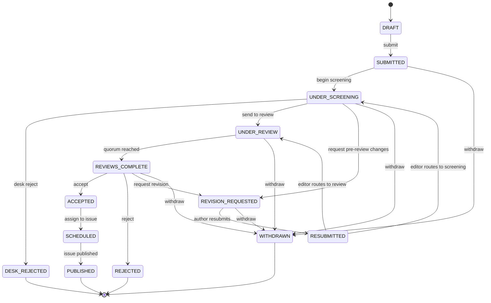

# Software Requirements Specification

**Project:** UGJCS — University of Ghana Journal of Computing Science
**Document:** 02 — Software Requirements Specification
**Author:** Roger Koranteng Obeng, student ID 22424140
**Assessor:** Prof. Solomon Mensah
**Date:** 2026-08-12
**Conformance:** Adapted from IEEE 830-1998 and ISO/IEC/IEEE 29148:2018
**Status:** Authoritative. Where this document and the implementation disagree, the
implementation governs and the disagreement is recorded (§4.1, §7).

---

## 1. Introduction

### 1.1 Purpose

This document specifies the functional and non-functional requirements of UGJCS, a
double-blind peer-reviewed journal management platform for the Department of Computer
Science, University of Ghana. It is written for three audiences: the assessor judging
requirements-engineering competence against this capstone's rubric, a future maintainer
who needs to know what the system is contracted to do, and the author's own
implementation, which this document constrains. Requirements are stated so that each is
individually testable; no requirement is expressed as an unmeasurable quality goal.

### 1.2 Scope

UGJCS manages the complete scholarly publishing lifecycle: account registration and
role-based access; manuscript submission with file upload; automated post-upload
processing; editorial screening; assisted reviewer assignment; structured double-blind
review; editorial decisions and revision rounds; issue composition and publication; a
public archive with search, citation export and metadata harvesting; and a tamper-evident
editorial audit trail. Payment processing, copy-editing/typesetting, multi-journal
tenancy, ORCID federation, real DOI registration, and plagiarism screening against
external corpora are explicitly out of scope (design specification §4.2). The full
functional boundary is enumerated in §5 of that specification and restated as testable
requirements in §3 of this document.

### 1.3 Definitions, acronyms and abbreviations

| Term | Meaning |
|---|---|
| UGJCS | University of Ghana Journal of Computing Science — the platform and the journal it hosts |
| Double-blind | Neither author nor reviewer identity is disclosed to the other party during review |
| MoSCoW | Must/Should/Could/Won't — requirement prioritisation scheme |
| UCP | Use Case Points — the effort-estimation technique that produced the MoSCoW cut |
| FR / NFR | Functional requirement / non-functional requirement |
| UC | Use case, as enumerated in the effort-estimation document |
| RBAC | Role-based access control |
| COI | Conflict of interest |
| EiC | Editor-in-Chief |
| HoD | Head of Department |
| BFF | Backend-for-Frontend — the Next.js server-side proxy pattern used for authenticated traffic |
| OAI-PMH | Open Archives Initiative Protocol for Metadata Harvesting |
| DOI | Digital Object Identifier (UGJCS issues DOI-*shaped* but unregistered identifiers — §4.2) |
| TF-IDF | Term frequency–inverse document frequency, used for reviewer–manuscript matching |
| LSH | Locality-sensitive hashing, used for near-duplicate similarity screening |
| WCAG | Web Content Accessibility Guidelines |
| RFC 9457 | Problem Details for HTTP APIs — the platform's error-response format |
| Hash chain | The append-only audit mechanism: each event hashes over its predecessor's hash and its own payload |

### 1.4 References

- Design specification — `docs/superpowers/specs/2026-08-12-ugjcs-journal-platform-design.md`
- Effort estimation — `docs/03-effort-estimation.md`
- Technical debt register — `docs/04-technical-debt-register.md`
- Domain implementation — `backend/src/ugjcs/domain/{transitions,enums,policies,blinding,manuscript,hashchain,events}.py`
- IEEE Std 830-1998, *Recommended Practice for Software Requirements Specifications*
- ISO/IEC/IEEE 29148:2018, *Systems and software engineering — Life cycle processes — Requirements engineering*

### 1.5 Overview

§2 describes the product, its user classes and its operating constraints. §3 states each
functional and non-functional requirement in testable form. §4 gives the manuscript
lifecycle as implemented, the actor/use-case mapping and the authorisation matrix. §5 is
the requirements traceability matrix, stated honestly for what is built versus planned.
§6 explains the MoSCoW prioritisation and how the effort estimate drove it. §7 states the
system's limitations plainly, cross-referenced to the technical debt register.

---

## 2. Overall description

### 2.1 Product perspective

UGJCS is a new, self-contained system; it replaces an ad hoc process of email and shared
spreadsheets rather than integrating with an existing departmental system. It is a
three-tier web application: a Next.js frontend (public archive statically rendered, all
authenticated traffic proxied server-side as a BFF), a FastAPI backend built as a
hexagonal architecture with a framework-free domain core, and PostgreSQL, S3 and Redis
as its persistence, storage and queueing infrastructure, deployed on AWS with Terraform
(design specification §7). Only the domain layer and the database persistence adapter
are implemented and tested at the time of this document; the application use-case layer
(beyond port protocols), the API layer and the frontend are planned but not yet built —
this is stated once here and carried through §5 and §7 rather than obscured.

### 2.2 Product functions — summary

- Register, authenticate and authorise users under five roles, several of which one
  account may hold concurrently.
- Accept manuscript submissions, validate and process them asynchronously, and produce
  an anonymised derivative for reviewers.
- Screen submissions and route them to review, revision, or desk rejection.
- Recommend reviewers by expertise match, exclude conflicts, balance workload, and let
  the editor accept, reject or override every recommendation.
- Collect structured, double-blind reviews and aggregate them into an editorial
  decision once a quorum is met.
- Support revision rounds between author and editor.
- Compose issues from accepted manuscripts and publish them to a public archive.
- Serve the archive to anonymous readers with full-text search, citation export and
  OAI-PMH harvesting.
- Record every editorial event in a tamper-evident, append-only log.

### 2.3 User classes and characteristics

| User class | Description | Frequency of use | Technical proficiency required |
|---|---|---|---|
| Author | Submits and tracks manuscripts, responds to review | Occasional, bursty around submission and revision | Low — web form and file upload only |
| Reviewer | Evaluates blinded manuscripts against structured criteria | Occasional, invitation-driven | Low |
| Editor | Screens submissions, assigns reviewers, records decisions | Regular, throughout each submission's lifecycle | Moderate — must interpret matching output and audit trail |
| Editor-in-Chief | All Editor capability plus issue composition, publication and policy configuration | Regular; final authority | Moderate |
| Administrator | Manages accounts, roles and reviewer capacity | Infrequent | Low |
| Reader | Anonymous; discovers, reads, cites and downloads published work | Frequent, unauthenticated | Low |
| Head of Department (secondary) | Consumes editorial throughput analytics | Infrequent | Low |
| Indexing service (external system) | Harvests metadata via a defined API | Automated, scheduled | N/A — machine actor |

A single account may hold multiple roles simultaneously (design specification §3); this
is a deliberate design choice with a direct security consequence recorded in §4.3 and
§7 (an Author–Reviewer dual-role holder is not currently prevented from reviewing their
own manuscript).

### 2.4 Operating environment

Backend: Python 3.13, FastAPI, PostgreSQL 16, Redis, ARQ worker, deployed as ECS Fargate
tasks behind an ALB, fronted by CloudFront for TLS on a `*.cloudfront.net` hostname (no
registered domain is available). Frontend: Next.js 15 / TypeScript / Tailwind, deployed
on Vercel. Storage: private S3 buckets, documents reachable only via short-lived
pre-signed URLs. Client environment: any evergreen browser at 360 px width or above;
readers require no account.

### 2.5 Design and implementation constraints

- A 48-hour solo development window (effort estimation §8), which forced the MoSCoW
  cut in §6 of this document.
- No registered domain — the CloudFront TLS strategy is not optional but architecturally
  necessary (design specification §7.3).
- AWS and Vercel free/low-cost tiers; operating cost is targeted at USD 35–55/month.
- Domain layer must import no framework code, enforced by an import-linter contract in
  CI (NFR-13).
- The domain layer is framework-free by construction; this is a testable constraint,
  not an aspiration.
- Synthetic seed data only — no real departmental submissions or reviewer data are used.

### 2.6 Assumptions and dependencies

Assumptions: a single journal instance suffices; reviewers participate without incentive
mechanisms; corpus scale is hundreds, not millions, of papers, justifying Postgres
full-text search over a dedicated search engine; authors submit PDFs; a single
transactional email provider is available. Dependencies: AWS managed services (ECS, RDS,
S3, CloudFront), Vercel, and a transactional email provider must remain available and
within free/low-cost tier limits for the system to operate as specified.

---

## 3. Specific requirements

Each functional requirement is stated as "the system shall …", is atomic (one testable
behaviour per identifier), and carries the preconditions that must hold before it may
fire, the postconditions guaranteed on success, and the acceptance criterion by which it
is verified. Identifiers are preserved unchanged from the design specification; no
requirement is renumbered. One requirement, **FR-25a**, is added beyond the original set
and is marked **NEW** — it was surfaced by comparing the implemented lifecycle guard
(`transitions.py`, which permits `WITHDRAWN` as a target state) against the implemented
authorisation layer (`policies.py`, which has no action gating who may invoke that
transition), a gap the original requirement (FR-25, which named the feature but not its
authorisation mechanism) did not anticipate.

### 3.1 Functional requirements

#### Group A — Identity and access

| ID | Statement | Actor | Pri | Preconditions | Postconditions | Acceptance criteria |
|---|---|---|---|---|---|---|
| FR-01 | The system shall let a person register an account and shall verify their email address before the account is usable. | Author, Reviewer | M | Email address not already registered | Account exists in an unverified state until the verification link is followed | Registration with a duplicate email is rejected; login is refused until verified |
| FR-02 | The system shall authenticate a registered user and maintain a session that expires and can be explicitly revoked. | All authenticated | M | Account verified | A valid session token is issued; revoked or expired tokens are rejected on every subsequent call | A revoked refresh token fails all further use; an expired access token is rejected without a valid session |
| FR-03 | The system shall let an Administrator assign and revoke roles, and a user may hold several roles concurrently. | Administrator | M | Target account exists | The account's role set reflects the change immediately | Assigning a second role does not remove the first; policy checks re-evaluate against the updated set on the next request |

#### Group B — Submission intake and processing

| ID | Statement | Actor | Pri | Preconditions | Postconditions | Acceptance criteria |
|---|---|---|---|---|---|---|
| FR-04 | The system shall let an Author create a submission comprising title, abstract, keywords, co-authors and a PDF file. | Author | M | Author is authenticated | Manuscript exists in `DRAFT`, then transitions to `SUBMITTED` | A manuscript with all required fields and a valid PDF reaches `SUBMITTED`; the transition is illegal from any other state |
| FR-05 | The system shall reject an uploaded file that fails type, size or integrity validation, and shall return a clear reason. | System | M | A file has been uploaded | Rejected files never reach persistent storage or a manuscript version | A renamed non-PDF file (validated by magic bytes, not extension) is rejected with a specific reason code |
| FR-06 | The system shall generate an anonymised copy of every submitted document, distinct from the original. | System | M | A manuscript version has been uploaded and validated | Two document references exist per version: original and anonymised | The anonymised derivative has XMP and DocInfo metadata stripped; reviewers are never issued the original |
| FR-20 | The system shall screen a submission for similarity against the internal corpus of previously submitted manuscripts. | System | S | Text has been extracted from the submission | A similarity report is persisted against the manuscript version | A near-duplicate submitted twice produces a report flagging the match; unrelated submissions produce no false positive on the seeded corpus |

#### Group C — Screening and reviewer assignment

| ID | Statement | Actor | Pri | Preconditions | Postconditions | Acceptance criteria |
|---|---|---|---|---|---|---|
| FR-07 | The system shall let an Editor or Editor-in-Chief screen a submission by sending it to review, requesting pre-review changes, or desk-rejecting it. | Editor | M | Manuscript is in `UNDER_SCREENING` | Manuscript moves to `UNDER_REVIEW`, `REVISION_REQUESTED` or `DESK_REJECTED` respectively | Any of the three legal targets is reachable only from `UNDER_SCREENING`; no other actor role can invoke it |
| FR-08 | The system shall recommend reviewers ranked by expertise match, excluding conflicts of interest and respecting reviewer capacity. | System | M | Manuscript is in `UNDER_SCREENING` or `UNDER_REVIEW` | A ranked candidate list is produced with a score and, for excluded reviewers, a stated reason | A reviewer sharing an author's affiliation, or already at capacity, never appears as a positive recommendation |
| FR-09 | The system shall let an Editor invite reviewers, and may override any system recommendation. | Editor | M | Manuscript is in `UNDER_SCREENING` or `UNDER_REVIEW` | A review assignment is created in the `INVITED` state | An editor-chosen reviewer outside the recommended list can still be invited |

#### Group D — Review and revision

| ID | Statement | Actor | Pri | Preconditions | Postconditions | Acceptance criteria |
|---|---|---|---|---|---|---|
| FR-10 | The system shall let an invited reviewer accept or decline the invitation, optionally with a reason. | Reviewer | M | Assignment is in `INVITED` | Assignment moves to `ACCEPTED` or `DECLINED` | A declined invitation frees the reviewer's capacity and is visible to the editor with its reason |
| FR-11 | The system shall let a reviewer with an accepted assignment submit a structured review: criterion scores, an overall recommendation, comments to the author, and confidential comments to the editor. | Reviewer | M | Assignment is `ACCEPTED`; manuscript is `UNDER_REVIEW` | A `Review` record is stored against the assignment; assignment moves to `SUBMITTED` | Confidential comments never appear in any author-facing view; a review cannot be submitted twice by the same reviewer for the same manuscript |
| FR-13 | The system shall let the corresponding author submit a revised version together with a response-to-reviewers letter. | Author | M | Manuscript is in `REVISION_REQUESTED`; actor is the corresponding author | Manuscript moves to `RESUBMITTED`, then to `UNDER_REVIEW` or `UNDER_SCREENING` at editorial discretion | A non-corresponding co-author's attempt to resubmit is denied; the letter is attached to the new version |

#### Group E — Editorial decision and withdrawal

| ID | Statement | Actor | Pri | Preconditions | Postconditions | Acceptance criteria |
|---|---|---|---|---|---|---|
| FR-12 | The system shall let an Editor or Editor-in-Chief record an editorial decision once the configured minimum number of reviews has been submitted. | Editor | M | Manuscript is `REVIEWS_COMPLETE` (or `UNDER_SCREENING` for desk rejection, which requires no reviews) | Manuscript moves to `ACCEPTED`, `REJECTED` or `REVISION_REQUESTED` | A decision attempted below quorum is refused with the current review count; desk rejection is legal only from `UNDER_SCREENING` |
| FR-25 | The system shall let the corresponding author withdraw a submission before a decision is recorded. | Author | S | Manuscript is in `SUBMITTED`, `UNDER_SCREENING`, `UNDER_REVIEW`, `REVIEWS_COMPLETE` or `REVISION_REQUESTED` | Manuscript moves to `WITHDRAWN`, a terminal state | A withdrawal attempted from `ACCEPTED` or any other non-listed state is refused |
| **FR-25a** *(NEW)* | The system shall authorise withdrawal only for the corresponding author of the manuscript being withdrawn, via a dedicated ownership-checked action equivalent to how `RESUBMIT` is checked. | Author | M *(elevated — closes a live authorisation gap)* | `Action.WITHDRAW` exists in the policy layer with the same ownership predicate as `Action.RESUBMIT` | An actor who is not the corresponding author, including a co-author, cannot invoke the transition regardless of role | A non-corresponding-author holder of the `AUTHOR` role attempting withdrawal is denied |

#### Group F — Publication and public archive

| ID | Statement | Actor | Pri | Preconditions | Postconditions | Acceptance criteria |
|---|---|---|---|---|---|---|
| FR-15 | The system shall let the Editor-in-Chief compose an issue from accepted manuscripts and publish it. | Editor-in-Chief | M | Manuscripts are `ACCEPTED`; actor holds `EDITOR_IN_CHIEF` | Manuscripts move `ACCEPTED → SCHEDULED → PUBLISHED`; the issue becomes publicly visible | An Editor without EiC role cannot publish; a manuscript not in `ACCEPTED` cannot be added to an issue |
| FR-16 | The system shall let an unauthenticated reader browse issues and read published papers. | Reader | M | Issue is `PUBLISHED` | Paper content and metadata are served without requiring login | Anonymous request to a published paper's page succeeds; request to an unpublished manuscript is refused |
| FR-17 | The system shall provide full-text search across published papers with filters. | Reader | M | At least one paper is published | Search returns ranked results within the performance bound of NFR-09 | A query on a distinctive term present only in one seeded paper returns that paper first |
| FR-18 | The system shall let a reader download a published paper's PDF. | Reader | M | Paper is published | The original (non-anonymised) PDF is served via the archive path | Download succeeds without authentication for any published paper |
| FR-21 | The system shall let a reader export a paper's citation as BibTeX and RIS. | Reader | S | Paper is published | A correctly formatted citation file is returned in the requested format | The exported BibTeX parses under a standard BibTeX parser without error |
| FR-22 | The system shall expose an OAI-PMH endpoint serving Dublin Core metadata for all published papers. | External system | S | At least one paper is published | `Identify`, `ListMetadataFormats`, `ListIdentifiers`, `ListRecords` and `GetRecord` all respond per OAI-PMH 2.0 | A harvest run against the seeded archive completes with resumption tokens honoured correctly |
| FR-27 | The system shall resolve a persistent identifier to its paper. | Reader | C | Identifier is DOI-shaped and assigned | Resolving the identifier returns (or redirects to) the paper | A well-formed but unassigned identifier returns a 404, not a server error |

#### Group G — Transparency and communication

| ID | Statement | Actor | Pri | Preconditions | Postconditions | Acceptance criteria |
|---|---|---|---|---|---|---|
| FR-14 | The system shall let an author view their own submissions and each one's status timeline. | Author | M | Actor is authenticated | Only manuscripts the actor authored are listed | An author cannot see another author's manuscript in this view, even by guessing its identifier |
| FR-19 | The system shall let an Editor or Editor-in-Chief view the complete audit trail for a manuscript. | Editor, EiC | M | Actor holds `EDITOR` or `EDITOR_IN_CHIEF` | The full, sequence-ordered event chain for the manuscript is returned | A Reviewer or Author role attempting this view is denied; the chain's hash verification passes |
| FR-23 | The system shall notify actors, in-app and by email where configured, of events affecting them. | System | S | An event affecting a specific actor has occurred | A notification record exists and, where email is configured, a message is queued for delivery | An editorial decision produces a notification visible to the affected author within the same request cycle |

#### Group H — Administration, configuration and analytics

| ID | Statement | Actor | Pri | Preconditions | Postconditions | Acceptance criteria |
|---|---|---|---|---|---|---|
| FR-24 | The system shall provide editorial analytics: throughput, decision mix, reviewer load and time-to-decision. | EiC, HoD | S | At least one full editorial cycle has completed | Aggregate figures are computed over the current dataset | Time-to-decision reported for a manuscript matches the difference between its submission and decision timestamps |
| FR-26 | The system shall let the Editor-in-Chief configure journal policy: minimum reviews, review window and blinding model. | EiC | C | Actor holds `EDITOR_IN_CHIEF` | Subsequent decisions and assignments respect the updated configuration | Lowering the minimum-review threshold takes effect for manuscripts not yet at decision, not retroactively |
| FR-28 | The system shall provide reviewer performance history and reliability indicators. | EiC | C | Reviewer has at least one completed or declined assignment | A per-reviewer summary (acceptance rate, on-time rate, average score deviation) is available | A reviewer who declines every invitation shows a 0% acceptance rate, not a null or error |

### 3.2 Non-functional requirements

Each non-functional requirement carries a stated **verification method** so that
"non-functional" does not collapse into "unverifiable."

#### Security

| ID | Requirement | Verification |
|---|---|---|
| NFR-01 | Passwords are hashed with Argon2id; no credential is ever written to a log. | Code review; unit test asserting the hashing algorithm and asserting no credential-shaped value appears in captured log output |
| NFR-02 | Every endpoint is authorised by an explicit policy; access is denied by default. | Integration test that walks the full route table and fails if any route lacks a policy check (design specification §11) |
| NFR-03 | Reviewer-facing payloads contain no author-identifying data. | Automated leak test enumerating every reviewer-facing endpoint, serialising against a fixture with sentinel author names, asserting no sentinel appears in output |
| NFR-04 | Documents are served only via short-lived pre-signed URLs; storage buckets are private. | Integration test confirming direct bucket access is refused; manual verification of URL expiry |
| NFR-05 | Authentication and submission endpoints are rate-limited. | Integration test exceeding the configured limit and asserting a 429 response |
| NFR-06 | Dependencies are scanned; no known high-severity vulnerability is present at release. | `pip-audit` and `npm audit` as CI gates |

#### Integrity

| ID | Requirement | Verification |
|---|---|---|
| NFR-07 | Audit events are append-only and hash-chained; any retrospective edit is detectable. | Property test over random legal event sequences confirming the chain always verifies; a tamper-detection test that mutates a stored event and confirms verification fails. **Demonstrated in the current build** by `backend/tests/unit/domain/test_hashchain.py` and the integration tests `test_append_only.py` and `test_chain_persistence.py`, including a PostgreSQL trigger rejecting `UPDATE`/`DELETE`/`TRUNCATE` on the event table (technical debt register TD-13) |

#### Performance

| ID | Requirement | Verification |
|---|---|---|
| NFR-08 | Public archive pages respond within 500 ms at p95 under nominal load. | k6 smoke test against a deployed environment |
| NFR-09 | Search returns within 800 ms at p95 over the seeded corpus. | k6 smoke test |

#### Reliability

| ID | Requirement | Verification |
|---|---|---|
| NFR-10 | Upload processing is idempotent and retried with exponential backoff on failure. | Unit test on the retry policy; integration test replaying the same content checksum and asserting no duplicate side effect |

#### Availability

| ID | Requirement | Verification |
|---|---|---|
| NFR-11 | The service exposes liveness and readiness probes; unhealthy tasks are replaced automatically. | Deployment verification against the ECS service's health-check configuration |

#### Usability

| ID | Requirement | Verification |
|---|---|---|
| NFR-12 | The interface is responsive from 360 px width, keyboard-navigable, and meets WCAG 2.1 AA contrast. | Manual audit; automated `axe` accessibility check in CI |

#### Maintainability

| ID | Requirement | Verification |
|---|---|---|
| NFR-13 | The domain layer imports no framework code. | Import-linter contract enforced as a CI gate |
| NFR-14 | The domain and application layers hold at least 85% line coverage. | CI coverage gate. **The delivered domain layer currently exceeds this floor** (technical debt register TD-10 records the 85% figure as a floor, not a target, and TD-11 records that coverage alone is a weak signal — four mutations survived a 100%-covered suite until closed by targeted tests) |

#### Observability

| ID | Requirement | Verification |
|---|---|---|
| NFR-15 | Structured JSON logs carry correlation IDs; traces are exported. | Manual verification against a deployed environment |

#### Portability

| ID | Requirement | Verification |
|---|---|---|
| NFR-16 | The entire infrastructure is reproducible from code. | `terraform apply` from a clean state, followed by `terraform destroy` |

#### Compliance

| ID | Requirement | Verification |
|---|---|---|
| NFR-17 | Personal data is minimised; the audit log retains identity only where required. | Design review against the data model (design specification §8) |

---

## 4. System models

### 4.1 Manuscript lifecycle

The lifecycle below is transcribed directly from `backend/src/ugjcs/domain/transitions.py`
— the `LEGAL_TRANSITIONS` mapping is the executable, tested source of truth, not the
narrative description in the design specification.

#### 4.1.1 State table

| Source state | Legal target states | Terminal? |
|---|---|---|
| `DRAFT` | `SUBMITTED` | No |
| `SUBMITTED` | `UNDER_SCREENING`, `WITHDRAWN` | No |
| `UNDER_SCREENING` | `DESK_REJECTED`, `UNDER_REVIEW`, `REVISION_REQUESTED`, `WITHDRAWN` | No |
| `UNDER_REVIEW` | `REVIEWS_COMPLETE`, `WITHDRAWN` | No |
| `REVIEWS_COMPLETE` | `ACCEPTED`, `REJECTED`, `REVISION_REQUESTED`, `WITHDRAWN` | No |
| `REVISION_REQUESTED` | `RESUBMITTED`, `WITHDRAWN` | No |
| `RESUBMITTED` | `UNDER_REVIEW`, `UNDER_SCREENING` | No |
| `ACCEPTED` | `SCHEDULED` | No |
| `SCHEDULED` | `PUBLISHED` | No |
| `DESK_REJECTED` | *(none)* | **Yes** |
| `REJECTED` | *(none)* | **Yes** |
| `PUBLISHED` | *(none)* | **Yes** |
| `WITHDRAWN` | *(none)* | **Yes** |

No transition is legal out of a terminal state; this is asserted directly by
`assert_legal`, which raises `IllegalTransitionError` for any pair not present in
`LEGAL_TRANSITIONS`. `ACCEPTED` and `SCHEDULED` are deliberately excluded from the
withdrawable set: once a manuscript is accepted, undoing that is editorial retraction —
a different action, with its own notice obligations — and is not modelled as withdrawal.

#### 4.1.2 State diagram

#### 4.1.3 Spec-versus-code disagreement — RESUBMITTED routing

The design specification's §6.2 diagram draws `RESUBMITTED` flowing directly into
`REVIEWS_COMPLETE` ("`RESUBMITTED` ◀── … ▶ `REVIEWS_COMPLETE`"), implying a resubmission
closes the review round automatically. The implemented `LEGAL_TRANSITIONS` table instead
routes `RESUBMITTED` to **either** `UNDER_REVIEW` **or** `UNDER_SCREENING`, at editorial
discretion — a resubmission may need fresh review, or may need re-screening first, but
never closes the review round by itself. **The code governs**, per this document's
instruction: FR-13's postcondition and the state diagram above are written to the
implemented behaviour, not the narrative diagram. This is a genuine, load-bearing
disagreement between the two documents and is recorded here rather than silently
resolved in one direction without comment.

### 4.2 Actor/use-case mapping

| Actor | Use cases (effort estimation §3) |
|---|---|
| Author | UC1, UC2, UC4, UC9 (as respondent is Reviewer; Author has no UC9 role), UC12, UC13, UC19, UC21 (recipient), UC23 |
| Reviewer | UC1, UC2, UC9, UC10, UC21 (recipient) |
| Editor | UC2, UC3 (Administrator only, not Editor — see note), UC6, UC7, UC8, UC11, UC18, UC21 (recipient) |
| Editor-in-Chief | All Editor use cases, plus UC14, UC22, UC24 |
| Administrator | UC3 |
| Reader | UC15, UC16, UC17, UC19 (public export, distinct from FR-19's audit view), UC20 (indirectly, as the harvested party), UC25 |
| Head of Department | UC22 (read-only consumer) |
| Indexing service | UC20 |
| System (no human actor) | UC5, UC7 (computation), UC21 (dispatch) |

*Note:* UC3 ("manage roles") is an Administrator-only use case per FR-03's actor
column; it is listed once and not duplicated against Editor.

### 4.3 Authorisation matrix

Derived directly from `backend/src/ugjcs/domain/policies.py` — `_ROLE_GRANTS` for
role-only actions, `_OWNERSHIP_ACTIONS` and `_can_view` for actions that also depend on
the actor's relationship to a specific manuscript, and the policy module's own docstring
for the one action (`REVIEW`) that is deliberately under-specified today.

| Action | Author | Reviewer | Editor | Editor-in-Chief | Administrator |
|---|---|---|---|---|---|
| `VIEW` | Own manuscripts only | — *(no dedicated action; see gap below)* | Yes | Yes | Yes |
| `SUBMIT` | Yes | — | — | — | — |
| `SCREEN` | — | — | Yes | Yes | — |
| `ASSIGN_REVIEWER` | — | — | Yes | Yes | — |
| `REVIEW` | — | Yes *(role-only — no conflict-of-interest predicate; TD-02)* | — | — | — |
| `DECIDE` | — | — | Yes | Yes | — |
| `RESUBMIT` | Corresponding author only | — | — | — | — |
| `PUBLISH` | — | — | — | Yes | — |
| `MANAGE_USERS` | — | — | — | — | Yes |
| `VIEW_AUDIT` | — | — | Yes | Yes | — |
| `WITHDRAW` *(FR-25a, not implemented)* | Should be corresponding author only | — | — | — | — |

**Known gaps in this matrix, cross-referenced to the technical debt register:**

- `REVIEW` is granted to any actor holding the `REVIEWER` role with no check that they
  are not also an author of, or affiliated with, the manuscript in question (**TD-02** —
  critical). Because `Manuscript.record_review` also does not check the submitting
  reviewer's identity against an accepted assignment (**TD-03** — critical), a
  dual-role actor could in principle both author and review-quorum a manuscript alone.
- There is no `Action` connecting `blinding.blind()` to `policies.can()` — a caller must
  remember to call `blind()` before serving a reviewer, and nothing in the authorisation
  layer enforces it (**TD-07** — scheduled).
- The editorial event log has no blinded projection and is protected by `VIEW_AUDIT`
  policy alone rather than by the type system (**TD-06** — scheduled).
- `Action.WITHDRAW` does not exist at all; this document's FR-25a records that gap as a
  requirement rather than leaving it implicit.

---

## 5. Requirements traceability matrix

Status categories used below: **Implemented & tested** (domain rule exists and is
covered by an automated test in the delivered codebase); **Partially implemented**
(some domain support exists but a critical behaviour is missing, cross-referenced to
the technical debt register); **Vocabulary only** (an enum or type exists with no
behaviour behind it); **Planned** (nothing exists yet in the delivered codebase; the use
case awaits the application-service, API and, where relevant, frontend layers — none of
which exist in this repository at the time of writing, confirmed by the absence of an
`api/` directory under `backend/src/ugjcs/` and of any frontend directory at the
repository root).

| FR | Use case | Module / endpoint | Test | Status |
|---|---|---|---|---|
| FR-01 | UC1 | *(none — no `User` aggregate in delivered domain code)* | *(none)* | Planned — `/auth` API and application service |
| FR-02 | UC2 | *(none)* | *(none)* | Planned — `/auth` refresh/logout, JWT + hashed refresh tokens (design spec §11) |
| FR-03 | UC3 | `domain/enums.py` (`Role`); `domain/policies.py` (`Action.MANAGE_USERS`) | `test_policies.py` (grant only) | Vocabulary and authorisation grant implemented & tested; `/admin` role-assignment use case planned |
| FR-04 | UC4 | `domain/manuscript.py`; `domain/transitions.py` (`DRAFT→SUBMITTED`) | `test_transitions.py`, `test_manuscript.py` | Lifecycle guard implemented & tested; file upload and `/manuscripts` endpoint planned |
| FR-05 | UC4 | *(none — pipeline not built)* | *(none)* | Planned |
| FR-06 | UC5 | *(none — metadata-stripping pipeline not built)* | *(none)* | Planned. *(Distinct from the structural, projection-level blinding in FR-11/NFR-03, which is implemented today.)* |
| FR-07 | UC6 | `domain/transitions.py`; `domain/policies.py` (`Action.SCREEN`) | `test_transitions.py`, `test_policies.py` | Implemented & tested; screening-queue use case and endpoint planned |
| FR-08 | UC7 | *(none — TF-IDF/Hungarian matcher not built)* | *(none)* | Planned |
| FR-09 | UC8 | `domain/policies.py` (`Action.ASSIGN_REVIEWER`, grant only); `domain/enums.py` (`AssignmentStatus`) | `test_policies.py` | Authorisation grant and vocabulary only; `ReviewAssignment` entity does not exist (TD-02, TD-03) |
| FR-10 | UC9 | `domain/enums.py` (`AssignmentStatus`) | *(none beyond enum)* | Vocabulary only; planned |
| FR-11 | UC10 | `domain/manuscript.py` (review-quorum counter); `domain/enums.py` (`Recommendation`) | `test_manuscript.py` | Partially implemented — quorum counter exists but is not identity-checked (**critical gap, TD-03**); structured `Review` value object with criterion scores planned |
| FR-12 | UC11 | `domain/transitions.py`; `domain/enums.py` (`DecisionType`); `domain/policies.py` (`Action.DECIDE`) | `test_transitions.py`, `test_policies.py` | Implemented & tested; quorum correctness depends on the unresolved TD-03 defect |
| FR-13 | UC12 | `domain/transitions.py`; `domain/policies.py` (`Action.RESUBMIT`, ownership-checked) | `test_transitions.py`, `test_policies.py` | Implemented & tested; response-letter capture and endpoint planned |
| FR-14 | UC13 | `domain/policies.py` (`Action.VIEW`, `_can_view`) | `test_policies.py` | Authorisation predicate implemented & tested; status-timeline view and endpoint planned |
| FR-15 | UC14 | `domain/transitions.py` (`ACCEPTED→SCHEDULED→PUBLISHED`); `domain/policies.py` (`Action.PUBLISH`) | `test_transitions.py`, `test_policies.py` | Implemented & tested; `Issue` aggregate, composition use case and `/issues` endpoint planned |
| FR-16 | UC15 | *(none)* | *(none)* | Planned |
| FR-17 | UC16 | *(none — `tsvector`/GIN design specified but not migrated)* | *(none)* | Planned |
| FR-18 | UC17 | *(none)* | *(none)* | Planned |
| FR-19 | UC18 | `domain/hashchain.py`; `domain/policies.py` (`Action.VIEW_AUDIT`) | `test_hashchain.py`; integration `test_append_only.py`, `test_chain_persistence.py` | Implemented & tested, including persistence-level enforcement; `/manuscripts/{id}/audit` endpoint and rendering planned |
| FR-20 | UC5 | *(none — MinHash/LSH not built)* | *(none)* | Planned |
| FR-21 | UC19 | *(none)* | *(none)* | Planned |
| FR-22 | UC20 | *(none)* | *(none)* | Planned |
| FR-23 | UC21 | *(none)* | *(none)* | Planned |
| FR-24 | UC22 | *(none)* | *(none)* | Planned |
| FR-25 | UC23 | `domain/transitions.py` (`WITHDRAWN` reachable from five states) | `test_transitions.py` | Lifecycle legality implemented & tested; **no authorisation predicate for who may invoke it** — see FR-25a |
| FR-25a *(NEW)* | UC23 | *(none — `Action.WITHDRAW` does not exist)* | *(none)* | Not implemented; newly identified gap, not yet a technical-debt register entry (recommended addition alongside TD-02/TD-03/TD-07) |
| FR-26 | UC24 | *(none)* | *(none)* | Deferred (Could-have; effort estimation §8.1) |
| FR-27 | UC25 | *(none)* | *(none)* | Deferred (Could-have) |
| FR-28 | *(no dedicated UC — reporting over UC10/UC22 data, effort estimation §3)* | *(none)* | *(none)* | Deferred (Could-have) |

**Reading this matrix honestly.** Of 29 requirement lines (FR-01…FR-28 plus the new
FR-25a), **9 are implemented and covered by an automated test in the delivered
codebase** (FR-04, FR-07, FR-12, FR-13, FR-14, FR-15, FR-19, plus the tested-but-partial
FR-03 and FR-09 grants counted separately below), **2 are partially implemented with a
named critical defect** (FR-11, and FR-25 whose lifecycle half is tested but whose
authorisation half is the FR-25a gap), **3 are vocabulary- or grant-only** (FR-03, FR-09,
FR-10), and **the remaining 16 are entirely planned** — no code exists for them in this
repository. This is expected at this stage: the domain layer (lifecycle, policies,
blinding, hash chain) and the database persistence adapter are complete and tested; the
application use-case layer, the API layer and the frontend are the subject of later
implementation plans referenced in the design specification (§7.1, §13) and are not yet
present. A matrix claiming otherwise would misrepresent the build.

---

## 6. Requirements prioritisation

Prioritisation uses MoSCoW, carried unchanged from the design specification (§5) and
made authoritative by the effort estimation document's scope decision (§8):

| Priority | Use cases | Decision |
|---|---|---|
| Must | UC1–UC18 | Implemented to production quality |
| Should | UC19–UC23 | Implemented only if Must-have work completes early |
| Could | UC24, UC25 | Deferred; recorded as technical debt with a repayment plan |

**How the estimate drove the cut.** Use Case Points sized the Must-have subset alone at
188 UUCP → 125.7 UCP → 2,514 person-hours (effort estimation §6), against a 48-hour
development window — 1.9% of the Must-have estimate. COCOMO II Early Design, an
independent cross-check on different inputs (source lines of code and process/product
ratings rather than actor and transaction counts), priced the full system at
approximately 7,170 person-hours. The two methods disagree by roughly 2.2× on the exact
figure but agree on the order of magnitude: both place the full system in the
one-to-four-person-year range, nearly two orders of magnitude beyond the available
window (effort estimation §7). That agreement, not either figure's precision, is what
forced a MoSCoW cut rather than an attempt to build everything thinly. Should-have items
are attempted only after every Must-have item reaches production quality; Could-have
items (FR-26, FR-27, FR-28) are not attempted within the window under any circumstance.

**Consequence for what exists today.** Even within the Must-have set, this document's
§5 traceability matrix shows the domain layer is further ahead than the surrounding
application, API and frontend layers, which remain planned. This is consistent with,
not contrary to, the MoSCoW cut: the cut governs *what* is built, not the *order* in
which layers within a use case are built, and a hexagonal architecture's domain core is
the natural first layer to complete and verify in isolation (design specification §7.1).

---

## 7. Constraints and limitations

This system does not guarantee everything its feature list might suggest. The following
limitations are stated plainly, each cross-referenced to `docs/04-technical-debt-register.md`.

- **Double-blind review is not text-scrubbed.** Anonymisation strips XMP and DocInfo
  metadata from the document (FR-06, once built) and omits author fields from the
  `BlindedManuscript` type by construction (`blinding.py`), but `title`, `abstract` and
  `keywords` are copied to reviewers **verbatim**. An author who writes their own name
  into the title, or an abstract that says "extending our earlier work in [Obeng
  2025]", reaches the reviewer unchanged. Double-blind integrity therefore depends
  partly on author compliance, not entirely on the system (**TD-05**, scheduled).
- **The audit trail has no external anchor.** Hash chaining (NFR-07, `hashchain.py`)
  detects alteration, reordering and removal *within* the chain, and a PostgreSQL
  trigger blocks `UPDATE`, `DELETE` and `TRUNCATE` on the event table. But truncation of
  the tail, a forged event appended through the legitimate API, or a wholly fabricated
  history rebuilt from the genesis hash, are **undetectable by the application alone** —
  there is no periodically published, independently held checkpoint to compare against
  (**TD-04**, scheduled).
- **A reviewer's conflict of interest is not checked by the authorisation layer.**
  `Action.REVIEW` is granted to any actor holding the `REVIEWER` role, with no
  per-manuscript predicate excluding authors or affiliated actors (**TD-02**,
  critical). Combined with the fact that submitted reviews are counted rather than
  identity-checked against an accepted assignment (**TD-03**, critical), a single
  reviewer could in principle close a review round alone. Neither has yet been reached
  by any built endpoint, but the gap is real the moment one is.
- **Withdrawal authorisation does not yet exist.** The lifecycle permits `WITHDRAWN`
  from five states (`transitions.py`), but no policy action gates who may invoke it —
  this document's FR-25a records that gap as a requirement (§3.1, Group E) rather than
  leaving it implicit; it is not yet reflected as its own entry in the technical debt
  register.
- **The editorial event log has no blinded view.** `EditorialEvent` carries `actor_id`
  and an editor's free-text rationale; there is no `BlindedEvent` projection, so a
  reviewer-facing audit view, if ever built, must not simply reuse `VIEW_AUDIT`'s
  current shape without one (**TD-06**, scheduled).
- **The current state is materialised, not derived by event replay.** The hybrid design
  (event log plus a materialised `status` column) is a deliberate trade-off against full
  event sourcing, mitigated by routing every state change through one `_transition`
  method. Two representations of the same fact could in principle diverge if that
  discipline is ever broken (**TD-09**, acceptable).
- **Coverage is a floor, not a proof of correctness.** The CI gate at 85% (NFR-14) is
  set below what the domain layer currently achieves and is a regression floor, not a
  target (**TD-10**). Separately, mutation testing during final review found defects
  surviving a suite at 100% line coverage — including deletion of the single line that
  makes the hash chain a chain — which coverage alone did not catch (**TD-11**,
  acceptable, provided compensated by targeted review; systematic mutation testing is
  recorded as future evolution, not yet in CI).
- **AWS access currently uses root credentials.** Unrelated to any functional
  requirement above, but blocking for deployment: the toolchain authenticates as the AWS
  account root user rather than a least-privilege IAM principal (**TD-01**, critical,
  must be resolved before any infrastructure is provisioned).
- **Explicit out-of-scope items** (design specification §4.2), restated here as hard
  limits rather than soft gaps: no payment or article-processing-charge handling; no
  copy-editing or typesetting workflow; no production-quality PDF galley generation; no
  multi-journal tenancy; no ORCID federation; identifiers are DOI-*shaped* but not
  registered with Crossref; similarity screening is against the internal corpus only,
  never the open web; email deliverability is guaranteed through one transactional
  provider only.
- **Requirements traceability is honest about build state, not aspirational.** §5 of
  this document shows the majority of functional requirements as planned rather than
  implemented at the time of writing. That is a statement about project sequencing
  (domain-first, per the hexagonal architecture), not a defect in this specification.
