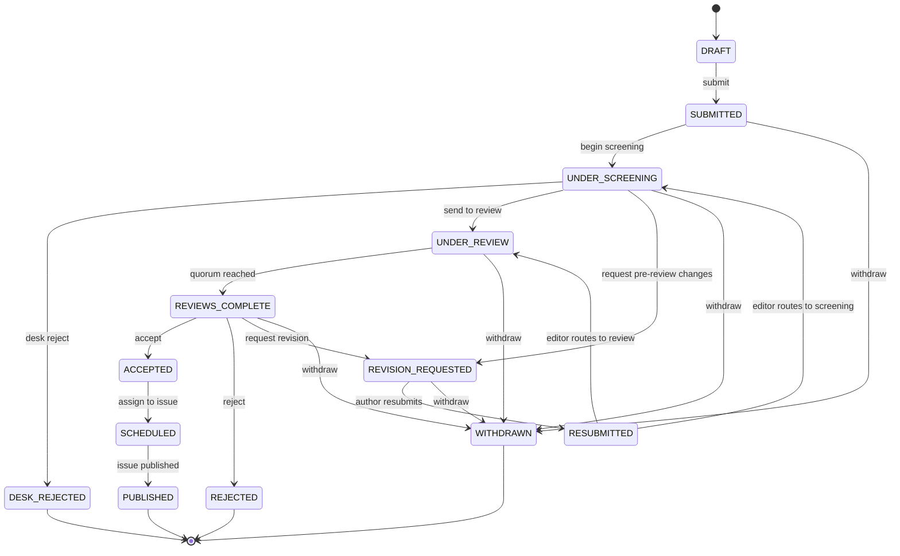

# Software Requirements Specification

**Project:** SDJ Editorial Portal — an editorial portal for the Science and Development
Journal (SDJ), published by the College of Basic and Applied Sciences (CBAS), University of Ghana
**Document:** 02 — Software Requirements Specification
**Author:** Roger Koranteng Obeng, student ID 22424140
**Assessor:** Prof. Solomon Mensah
**Date:** 2026-08-12
**Conformance:** Adapted from IEEE 830-1998 and ISO/IEC/IEEE 29148:2018
**Status:** Authoritative. Where this document and the implementation disagree, the
implementation governs and the disagreement is recorded (section 4.1, section 7).

**Naming.** The product specified here is the **SDJ Editorial Portal**. The repository
(`github.com/rogerkorantenng/ugjcs`), hosting URLs, package names and infrastructure resource
names retain the pilot's internal codename **UGJCS**; wherever `ugjcs` appears in a path, URL
or identifier, it is that codename, not a separate system. The deployed system is a prototype
built for an Advanced Software Engineering exam, not SDJ's official production system.

**Revision note (2026-08-12, post-implementation).** This document was originally authored
before the API and frontend existed, when only the domain layer and the database
persistence adapter were built. Section 2.1, section 2.4, section 4.3, section 5 and section 7 have since been revised against
the finished, deployed system — the live API (`https://tsxsbf9rzp.us-east-1.awsapprunner.com`,
confirmed against its own `/openapi.json`), the live frontend
(`https://ugjcs-frontend.vercel.app`), the backend source under `backend/src/ugjcs/api/` and
`frontend/src/app/`, the test suites under `backend/tests/`, and
`docs/06-testing-report.md`. That first revision moved twelve requirements from planned to
implemented-and-tested, refined six to "partially implemented" with a named gap, and left
eleven genuinely not implemented.

A second revision on 2026-08-14 reconciled the document against two feature waves that
landed after the original build. It moved eight further lines to implemented-and-tested,
added six new requirements (FR-29 to FR-34) for capabilities the original set never
anticipated, and corrected several rows that had begun to understate the system rather
than overstate it. The current totals are in section 5. Requirement identifiers, MoSCoW
priorities and the sections neither revision touched are unchanged from the original.

---

## 1. Introduction

### 1.1 Purpose

This document specifies the functional and non-functional requirements of the SDJ Editorial
Portal, a double-blind peer-review and editorial management platform built for the Science
and Development Journal (SDJ), published by the College of Basic and Applied Sciences,
University of Ghana. It is written for three audiences: the assessor judging
requirements-engineering competence against this final project's rubric, a future maintainer
who needs to know what the system is contracted to do, and the author's own
implementation, which this document constrains. Requirements are stated so that each is
individually testable; no requirement is expressed as an unmeasurable quality goal.

### 1.2 Scope

The portal manages SDJ's complete scholarly publishing lifecycle: account registration and
role-based access; manuscript submission with file upload; automated post-upload
processing; editorial screening; assisted reviewer assignment; structured double-blind
review; editorial decisions and revision rounds; issue composition and publication; a
public archive with search, citation export and metadata harvesting; and a tamper-evident
editorial audit trail. Payment processing, copy-editing/typesetting, multi-journal
tenancy, ORCID federation, real DOI registration, and plagiarism screening against
external corpora are explicitly out of scope (design specification section 4.2). The full
functional boundary is enumerated in section 5 of that specification and restated as testable
requirements in section 3 of this document.

### 1.3 Definitions, acronyms and abbreviations

| Term | Meaning |
|---|---|
| SDJ | Science and Development Journal — the established CBAS journal this portal is built for |
| CBAS | College of Basic and Applied Sciences, University of Ghana — SDJ's publisher and the project's client |
| UGJCS | The pilot's internal codename for this system (see the naming note above) — survives only in package names, the repository name and hosting URLs |
| Double-blind | Neither author nor reviewer identity is disclosed to the other party during review |
| MoSCoW | Must/Should/Could/Won't — requirement prioritisation scheme |
| UCP | Use Case Points — the effort-estimation technique that produced the MoSCoW cut |
| FR / NFR | Functional requirement / non-functional requirement |
| UC | Use case, as enumerated in the effort-estimation document |
| RBAC | Role-based access control |
| COI | Conflict of interest |
| EiC | Editor-in-Chief |
| HoD | Head of Department — the design's shorthand for the college-leadership analytics consumer |
| BFF | Backend-for-Frontend — the Next.js server-side proxy pattern used for authenticated traffic |
| OAI-PMH | Open Archives Initiative Protocol for Metadata Harvesting |
| DOI | Digital Object Identifier (the portal issues DOI-*shaped* but unregistered identifiers — section 4.2) |
| TF-IDF | Term frequency–inverse document frequency, used for reviewer–manuscript matching |
| LSH | Locality-sensitive hashing, used for near-duplicate similarity screening |
| WCAG | Web Content Accessibility Guidelines |
| RFC 9457 | Problem Details for HTTP APIs — the platform's error-response format |
| Hash chain | The append-only audit mechanism: each event hashes over its predecessor's hash and its own payload |

### 1.4 References

- Design specification — `docs/superpowers/specs/2026-08-12-ugjcs-journal-platform-design.md`
- Effort estimation — `docs/03-effort-estimation.md`
- Technical debt register — `docs/04-technical-debt-register.md`
- Domain implementation — `backend/src/ugjcs/domain/{transitions,enums,policies,blinding,manuscript,hashchain,events}.py`
- IEEE Std 830-1998, *Recommended Practice for Software Requirements Specifications*
- ISO/IEC/IEEE 29148:2018, *Systems and software engineering — Life cycle processes — Requirements engineering*

### 1.5 Overview

Section 2 describes the product, its user classes and its operating constraints. Section 3 states each
functional and non-functional requirement in testable form. Section 4 gives the manuscript
lifecycle as implemented, the actor/use-case mapping and the authorisation matrix. Section 5 is
the requirements traceability matrix, stated honestly for what is built versus planned.
Section 6 explains the MoSCoW prioritisation and how the effort estimate drove it. Section 7 states the
system's limitations plainly, cross-referenced to the technical debt register.

---

## 2. Overall description

### 2.1 Product perspective

The portal is a new, self-contained system built for the Science and Development Journal
(SDJ), published by the College of Basic and Applied Sciences; it replaces the journal's
current ad hoc process of email, shared drives and spreadsheets rather than integrating
with an existing editorial system. It is a
three-tier web application: a Next.js frontend (public archive, search, paper detail, and
author/reviewer/editor/Editor-in-Chief screens, with all authenticated traffic proxied
server-side as a Backend-For-Frontend), a FastAPI backend built as a hexagonal
architecture with a framework-free domain core, and PostgreSQL and S3 as its persistence
and document-storage infrastructure.

**This is no longer a forward-looking description.** The domain layer, the database
persistence adapter, the application use-case layer, the FastAPI API layer
(`/auth`, `/admin`, `/billing`, `/manuscripts`, `/editorial`, `/editorial-certificate`,
`/reviews`, `/archive`, `/people`, `/health`, `/ready`) and the Next.js frontend are all
built, tested and deployed: API at `https://tsxsbf9rzp.us-east-1.awsapprunner.com`,
frontend at `https://ugjcs-frontend.vercel.app`. Section 5's traceability matrix states,
requirement by requirement, which of these are implemented and tested, which are partially
built with a named gap, and which are not built at all.

Four things named in the original design remain unbuilt: OAI-PMH harvesting (FR-22),
similarity screening (FR-20), notifications of any kind, and asynchronous post-upload
processing. Redis and an ARQ worker were designed for that last one (design specification
Section 7) but are absent from the delivered codebase, and nothing in the current system depends
on them; FR-20 is the requirement that would have used them. Terraform-managed
ECS/ALB/CloudFront was the original deployment design, and the actual deployment target
differs (section 2.4, TD-14).

Six capabilities have no counterpart in the original requirement set, because they were
identified after it was written. They are added as FR-29 to FR-34: article processing
charges, the administrator console, decision certificates, anonymisation preflight, review
deadlines, and self-service author registration.

### 2.2 Product functions — summary

- Register, authenticate and authorise users under five roles, several of which one
  account may hold concurrently.
- Accept manuscript submissions, validate and process them asynchronously, and produce
  an anonymised derivative for reviewers.
- Screen submissions and route them to review, revision, or desk rejection.
- Recommend reviewers by expertise match, exclude conflicts, balance workload, and let
  the editor accept, reject or override every recommendation.
- Collect structured, double-blind reviews and aggregate them into an editorial
  decision once a quorum is met.
- Support revision rounds between author and editor.
- Compose issues from accepted manuscripts and publish them to a public archive.
- Serve the archive to anonymous readers with full-text search, citation export and
  OAI-PMH harvesting.
- Record every editorial event in a tamper-evident, append-only log.

- Bill and settle an article processing charge once a paper is accepted.
- Administer accounts, roles, reviewer capacity and activation from a console.
- Let anyone verify a published paper's editorial history against a tamper-evident chain.

*This list states intended product scope. It is not a claim that every bullet is built.
Section 5's traceability matrix is the authoritative, requirement-by-requirement account of what
is implemented today. Of the bullets above, asynchronous processing (section 2.1) and OAI-PMH
harvesting (FR-22) are the two that are not built.*

### 2.3 User classes and characteristics

| User class | Description | Frequency of use | Technical proficiency required |
|---|---|---|---|
| Author | Submits and tracks manuscripts, responds to review | Occasional, bursty around submission and revision | Low — web form and file upload only |
| Reviewer | Evaluates blinded manuscripts against structured criteria | Occasional, invitation-driven | Low |
| Editor | Screens submissions, assigns reviewers, records decisions | Regular, throughout each submission's lifecycle | Moderate — must interpret matching output and audit trail |
| Editor-in-Chief | All Editor capability plus issue composition, publication and policy configuration | Regular; final authority | Moderate |
| Administrator | Manages accounts, roles and reviewer capacity | Infrequent | Low |
| Reader | Anonymous; discovers, reads, cites and downloads published work | Frequent, unauthenticated | Low |
| CBAS college leadership (secondary) | Consumes editorial throughput analytics | Infrequent | Low |
| Indexing service (external system) | Harvests metadata via a defined API | Automated, scheduled | N/A — machine actor |

A single account may hold multiple roles simultaneously (design specification section 3); this
is a deliberate design choice with a direct security consequence recorded in section 4.3 and
Section 7 (an Author–Reviewer dual-role holder is not currently prevented from reviewing their
own manuscript).

### 2.4 Operating environment

**As deployed** (superseding the design specification's ECS/ALB/CloudFront topology —
see TD-14 for why, and for why no functional capability was lost by the substitution):
Backend: Python 3.13, FastAPI, PostgreSQL 16, deployed as a container on AWS App Runner,
reachable at `https://tsxsbf9rzp.us-east-1.awsapprunner.com` with a trusted TLS
certificate on App Runner's own `*.awsapprunner.com` hostname (no registered domain is
available, which is what the CloudFront design was originally solving; App Runner
supplies the same guarantee directly). Frontend: Next.js 15 / TypeScript / Tailwind,
deployed on Vercel at `https://ugjcs-frontend.vercel.app`. Storage: private S3 buckets,
documents reachable only via short-lived pre-signed URLs. Client environment: any
evergreen browser at 360 px width or above; readers require no account. Redis and an ARQ
worker, specified for asynchronous post-upload processing, are not present in the
delivered infrastructure — nothing currently deployed depends on them (section 2.1).

### 2.5 Design and implementation constraints

- A 48-hour solo development window (effort estimation section 8), which forced the MoSCoW
  cut in section 6 of this document.
- No registered domain — the CloudFront TLS strategy is not optional but architecturally
  necessary (design specification section 7.3).
- AWS and Vercel free/low-cost tiers; operating cost is targeted at USD 35–55/month.
- Domain layer must import no framework code, enforced by an import-linter contract in
  CI (NFR-13). **As delivered**, two contracts are enforced (`backend/.importlinter`):
  `domain-purity` (the constraint above) and `layers` (`api → infrastructure →
  application → domain`, dependencies point inward only) — both gate `make check` and
  therefore CI on every push and pull request.
- The domain layer is framework-free by construction; this is a testable constraint,
  not an aspiration.
- Synthetic seed data only — no real SDJ submissions or reviewer data are used.

### 2.6 Assumptions and dependencies

Assumptions (stated as assumptions — the project had no access to real SDJ operational
data): a single journal instance, SDJ itself, suffices; reviewers participate without
incentive mechanisms; SDJ's corpus scale is hundreds, not millions, of papers, justifying Postgres
full-text search over a dedicated search engine; authors submit PDFs; a single
transactional email provider is available. Dependencies: AWS managed services (ECS, RDS,
S3, CloudFront), Vercel, and a transactional email provider must remain available and
within free/low-cost tier limits for the system to operate as specified.

---

## 3. Specific requirements

Each functional requirement is stated as "the system shall …", is atomic (one testable
behaviour per identifier), and carries the preconditions that must hold before it may
fire, the postconditions guaranteed on success, and the acceptance criterion by which it
is verified. Identifiers are preserved unchanged from the design specification; no
requirement is renumbered. One requirement, **FR-25a**, is added beyond the original set
and is marked **NEW** — it was surfaced by comparing the implemented lifecycle guard
(`transitions.py`, which permits `WITHDRAWN` as a target state) against the implemented
authorisation layer (`policies.py`, which has no action gating who may invoke that
transition), a gap the original requirement (FR-25, which named the feature but not its
authorisation mechanism) did not anticipate.

### 3.1 Functional requirements

#### Group A — Identity and access

| ID | Statement | Actor | Pri | Preconditions | Postconditions | Acceptance criteria |
|---|---|---|---|---|---|---|
| FR-01 | The system shall let a person register an account and shall verify their email address before the account is usable. | Author, Reviewer | M | Email address not already registered | Account exists in an unverified state until the verification link is followed | Registration with a duplicate email is rejected; login is refused until verified |
| FR-02 | The system shall authenticate a registered user and maintain a session that expires and can be explicitly revoked. | All authenticated | M | Account verified | A valid session token is issued; revoked or expired tokens are rejected on every subsequent call | A revoked refresh token fails all further use; an expired access token is rejected without a valid session |
| FR-03 | The system shall let an Administrator assign and revoke roles, and a user may hold several roles concurrently. | Administrator | M | Target account exists | The account's role set reflects the change immediately | Assigning a second role does not remove the first; policy checks re-evaluate against the updated set on the next request |

#### Group B — Submission intake and processing

| ID | Statement | Actor | Pri | Preconditions | Postconditions | Acceptance criteria |
|---|---|---|---|---|---|---|
| FR-04 | The system shall let an Author create a submission comprising title, abstract, keywords, co-authors and a PDF file. | Author | M | Author is authenticated | Manuscript exists in `DRAFT`, then transitions to `SUBMITTED` | A manuscript with all required fields and a valid PDF reaches `SUBMITTED`; the transition is illegal from any other state |
| FR-05 | The system shall reject an uploaded file that fails type, size or integrity validation, and shall return a clear reason. | System | M | A file has been uploaded | Rejected files never reach persistent storage or a manuscript version | A renamed non-PDF file (validated by magic bytes, not extension) is rejected with a specific reason code |
| FR-06 | The system shall generate an anonymised copy of every submitted document, distinct from the original. | System | M | A manuscript version has been uploaded and validated | Two document references exist per version: original and anonymised | The anonymised derivative has XMP and DocInfo metadata stripped; reviewers are never issued the original |
| FR-20 | The system shall screen a submission for similarity against the internal corpus of previously submitted manuscripts. | System | S | Text has been extracted from the submission | A similarity report is persisted against the manuscript version | A near-duplicate submitted twice produces a report flagging the match; unrelated submissions produce no false positive on the seeded corpus |

#### Group C — Screening and reviewer assignment

| ID | Statement | Actor | Pri | Preconditions | Postconditions | Acceptance criteria |
|---|---|---|---|---|---|---|
| FR-07 | The system shall let an Editor or Editor-in-Chief screen a submission by sending it to review, requesting pre-review changes, or desk-rejecting it. | Editor | M | Manuscript is in `UNDER_SCREENING` | Manuscript moves to `UNDER_REVIEW`, `REVISION_REQUESTED` or `DESK_REJECTED` respectively | Any of the three legal targets is reachable only from `UNDER_SCREENING`; no other actor role can invoke it |
| FR-08 | The system shall recommend reviewers ranked by expertise match, excluding conflicts of interest and respecting reviewer capacity. | System | M | Manuscript is in `UNDER_SCREENING` or `UNDER_REVIEW` | A ranked candidate list is produced with a score and, for excluded reviewers, a stated reason | A reviewer sharing an author's affiliation, or already at capacity, never appears as a positive recommendation |
| FR-09 | The system shall let an Editor invite reviewers, and may override any system recommendation. | Editor | M | Manuscript is in `UNDER_SCREENING` or `UNDER_REVIEW` | A review assignment is created in the `INVITED` state | An editor-chosen reviewer outside the recommended list can still be invited |

#### Group D — Review and revision

| ID | Statement | Actor | Pri | Preconditions | Postconditions | Acceptance criteria |
|---|---|---|---|---|---|---|
| FR-10 | The system shall let an invited reviewer accept or decline the invitation, optionally with a reason. | Reviewer | M | Assignment is in `INVITED` | Assignment moves to `ACCEPTED` or `DECLINED` | A declined invitation frees the reviewer's capacity and is visible to the editor with its reason |
| FR-11 | The system shall let a reviewer with an accepted assignment submit a structured review: criterion scores, an overall recommendation, comments to the author, and confidential comments to the editor. | Reviewer | M | Assignment is `ACCEPTED`; manuscript is `UNDER_REVIEW` | A `Review` record is stored against the assignment; assignment moves to `SUBMITTED` | Confidential comments never appear in any author-facing view; a review cannot be submitted twice by the same reviewer for the same manuscript |
| FR-13 | The system shall let the corresponding author submit a revised version together with a response-to-reviewers letter. | Author | M | Manuscript is in `REVISION_REQUESTED`; actor is the corresponding author | Manuscript moves to `RESUBMITTED`, then to `UNDER_REVIEW` or `UNDER_SCREENING` at editorial discretion | A non-corresponding co-author's attempt to resubmit is denied; the letter is attached to the new version |

#### Group E — Editorial decision and withdrawal

| ID | Statement | Actor | Pri | Preconditions | Postconditions | Acceptance criteria |
|---|---|---|---|---|---|---|
| FR-12 | The system shall let an Editor or Editor-in-Chief record an editorial decision once the configured minimum number of reviews has been submitted. | Editor | M | Manuscript is `REVIEWS_COMPLETE` (or `UNDER_SCREENING` for desk rejection, which requires no reviews) | Manuscript moves to `ACCEPTED`, `REJECTED` or `REVISION_REQUESTED` | A decision attempted below quorum is refused with the current review count; desk rejection is legal only from `UNDER_SCREENING` |
| FR-25 | The system shall let the corresponding author withdraw a submission before a decision is recorded. | Author | S | Manuscript is in `SUBMITTED`, `UNDER_SCREENING`, `UNDER_REVIEW`, `REVIEWS_COMPLETE` or `REVISION_REQUESTED` | Manuscript moves to `WITHDRAWN`, a terminal state | A withdrawal attempted from `ACCEPTED` or any other non-listed state is refused |
| **FR-25a** *(NEW)* | The system shall authorise withdrawal only for the corresponding author of the manuscript being withdrawn, via a dedicated ownership-checked action equivalent to how `RESUBMIT` is checked. | Author | M *(elevated — closes a live authorisation gap)* | `Action.WITHDRAW` exists in the policy layer with the same ownership predicate as `Action.RESUBMIT` | An actor who is not the corresponding author, including a co-author, cannot invoke the transition regardless of role | A non-corresponding-author holder of the `AUTHOR` role attempting withdrawal is denied |

#### Group F — Publication and public archive

| ID | Statement | Actor | Pri | Preconditions | Postconditions | Acceptance criteria |
|---|---|---|---|---|---|---|
| FR-15 | The system shall let the Editor-in-Chief compose an issue from accepted manuscripts and publish it. | Editor-in-Chief | M | Manuscripts are `ACCEPTED`; actor holds `EDITOR_IN_CHIEF` | Manuscripts move `ACCEPTED → SCHEDULED → PUBLISHED`; the issue becomes publicly visible | An Editor without EiC role cannot publish; a manuscript not in `ACCEPTED` cannot be added to an issue |
| FR-16 | The system shall let an unauthenticated reader browse issues and read published papers. | Reader | M | Issue is `PUBLISHED` | Paper content and metadata are served without requiring login | Anonymous request to a published paper's page succeeds; request to an unpublished manuscript is refused |
| FR-17 | The system shall provide full-text search across published papers with filters. | Reader | M | At least one paper is published | Search returns ranked results within the performance bound of NFR-09 | A query on a distinctive term present only in one seeded paper returns that paper first |
| FR-18 | The system shall let a reader download a published paper's PDF. | Reader | M | Paper is published | The original (non-anonymised) PDF is served via the archive path | Download succeeds without authentication for any published paper |
| FR-21 | The system shall let a reader export a paper's citation as BibTeX and RIS. | Reader | S | Paper is published | A correctly formatted citation file is returned in the requested format | The exported BibTeX parses under a standard BibTeX parser without error |
| FR-22 | The system shall expose an OAI-PMH endpoint serving Dublin Core metadata for all published papers. | External system | S | At least one paper is published | `Identify`, `ListMetadataFormats`, `ListIdentifiers`, `ListRecords` and `GetRecord` all respond per OAI-PMH 2.0 | A harvest run against the seeded archive completes with resumption tokens honoured correctly |
| FR-27 | The system shall resolve a persistent identifier to its paper. | Reader | C | Identifier is DOI-shaped and assigned | Resolving the identifier returns (or redirects to) the paper | A well-formed but unassigned identifier returns a 404, not a server error |

#### Group G — Transparency and communication

| ID | Statement | Actor | Pri | Preconditions | Postconditions | Acceptance criteria |
|---|---|---|---|---|---|---|
| FR-14 | The system shall let an author view their own submissions and each one's status timeline. | Author | M | Actor is authenticated | Only manuscripts the actor authored are listed | An author cannot see another author's manuscript in this view, even by guessing its identifier |
| FR-19 | The system shall let an Editor or Editor-in-Chief view the complete audit trail for a manuscript. | Editor, EiC | M | Actor holds `EDITOR` or `EDITOR_IN_CHIEF` | The full, sequence-ordered event chain for the manuscript is returned | A Reviewer or Author role attempting this view is denied; the chain's hash verification passes |
| FR-23 | The system shall notify actors, in-app and by email where configured, of events affecting them. | System | S | An event affecting a specific actor has occurred | A notification record exists and, where email is configured, a message is queued for delivery | An editorial decision produces a notification visible to the affected author within the same request cycle |

#### Group H — Administration, configuration and analytics

| ID | Statement | Actor | Pri | Preconditions | Postconditions | Acceptance criteria |
|---|---|---|---|---|---|---|
| FR-24 | The system shall provide editorial analytics: throughput, decision mix, reviewer load and time-to-decision. | EiC, HoD | S | At least one full editorial cycle has completed | Aggregate figures are computed over the current dataset | Time-to-decision reported for a manuscript matches the difference between its submission and decision timestamps |
| FR-26 | The system shall let the Editor-in-Chief configure journal policy: minimum reviews, review window and blinding model. | EiC | C | Actor holds `EDITOR_IN_CHIEF` | Subsequent decisions and assignments respect the updated configuration | Lowering the minimum-review threshold takes effect for manuscripts not yet at decision, not retroactively |
| FR-28 | The system shall provide reviewer performance history and reliability indicators. | EiC | C | Reviewer has at least one completed or declined assignment | A per-reviewer summary (acceptance rate, on-time rate, average score deviation) is available | A reviewer who declines every invitation shows a 0% acceptance rate, not a null or error |
| FR-30 | The system shall let an Administrator manage accounts: grant and revoke roles, set reviewer capacity, and deactivate accounts. | Administrator | M | Actor holds `ADMINISTRATOR` | The account's roles, capacity or activation state are updated and visible on the next read | The administrator role itself cannot be granted or revoked through this interface, and an administrator cannot deactivate their own account |
| FR-33 | The system shall record a due date for each review assignment and mark an assignment overdue once that date passes without a submitted review. | Editor, EiC | S | A reviewer is assigned to a manuscript | The assignment carries a deadline and a server-computed overdue flag | A review submitted after its deadline is not flagged overdue; an assignment with no deadline is never flagged overdue |

#### Group I — Publication economics and scholarly record

| ID | Statement | Actor | Pri | Preconditions | Postconditions | Acceptance criteria |
|---|---|---|---|---|---|---|
| FR-29 | The system shall raise an article processing charge when a manuscript is accepted, and let the corresponding author settle it through a payment gateway. | Author, EiC | S | Manuscript is `ACCEPTED`, `SCHEDULED` or `PUBLISHED` | An invoice exists with a status of `pending`, `paid` or `waived` | No invoice exists before acceptance; a settled invoice cannot be waived, and a waived invoice cannot be verified |
| FR-31 | The system shall issue a signed-style decision certificate for a manuscript whose final decision is recorded. | Editor, EiC | C | An `accept` or `reject` decision exists in the manuscript's event chain | A PDF stating the decision, the tracking code and the audit chain's head hash is returned | Requesting a certificate before any final decision is a 409, not an empty document |
| FR-32 | The system shall report, at submission time, what the anonymiser removed from the uploaded document and what it could not remove. | Author | S | A document has been uploaded | The submission response carries a report of removed metadata keys and any author names still detectable in the body text | An author whose name appears in the manuscript body is told so at submission rather than after a reviewer sees it |
| FR-34 | The system shall let a member of the public register an author account without editorial-office involvement. | Reader | S | The email address is not already registered | An account exists holding exactly the `AUTHOR` role, signed in | Registration cannot grant reviewer, editor or administrator roles under any request body |

### 3.2 Non-functional requirements

Each non-functional requirement carries a stated **verification method** so that
"non-functional" does not collapse into "unverifiable."

#### Security

| ID | Requirement | Verification |
|---|---|---|
| NFR-01 | Passwords are hashed with Argon2id; no credential is ever written to a log. | Code review; unit test asserting the hashing algorithm and asserting no credential-shaped value appears in captured log output |
| NFR-02 | Every endpoint is authorised by an explicit policy; access is denied by default. | Integration test that walks the full route table and fails if any route lacks a policy check (design specification section 11) |
| NFR-03 | Reviewer-facing payloads contain no author-identifying data. | Automated leak test enumerating every reviewer-facing endpoint, serialising against a fixture with sentinel author names, asserting no sentinel appears in output |
| NFR-04 | Documents are served only via short-lived pre-signed URLs; storage buckets are private. | Integration test confirming direct bucket access is refused; manual verification of URL expiry |
| NFR-05 | Authentication and submission endpoints are rate-limited. | Integration test exceeding the configured limit and asserting a 429 response |
| NFR-06 | Dependencies are scanned; no known high-severity vulnerability is present at release. | `pip-audit` and `npm audit` as CI gates |

#### Integrity

| ID | Requirement | Verification |
|---|---|---|
| NFR-07 | Audit events are append-only and hash-chained; any retrospective edit is detectable. | Property test over random legal event sequences confirming the chain always verifies; a tamper-detection test that mutates a stored event and confirms verification fails. **Demonstrated in the current build** by `backend/tests/unit/domain/test_hashchain.py` and the integration tests `test_append_only.py` and `test_chain_persistence.py`, including a PostgreSQL trigger rejecting `UPDATE`/`DELETE`/`TRUNCATE` on the event table (technical debt register TD-13) |

#### Performance

| ID | Requirement | Verification |
|---|---|---|
| NFR-08 | Public archive pages respond within 500 ms at p95 under nominal load. | k6 smoke test against a deployed environment |
| NFR-09 | Search returns within 800 ms at p95 over the seeded corpus. | k6 smoke test |

#### Reliability

| ID | Requirement | Verification |
|---|---|---|
| NFR-10 | Upload processing is idempotent and retried with exponential backoff on failure. | Unit test on the retry policy; integration test replaying the same content checksum and asserting no duplicate side effect |

#### Availability

| ID | Requirement | Verification |
|---|---|---|
| NFR-11 | The service exposes liveness and readiness probes; unhealthy tasks are replaced automatically. | Deployment verification against the ECS service's health-check configuration |

#### Usability

| ID | Requirement | Verification |
|---|---|---|
| NFR-12 | The interface is responsive from 360 px width, keyboard-navigable, and meets WCAG 2.1 AA contrast. | Manual audit; automated `axe` accessibility check in CI |

#### Maintainability

| ID | Requirement | Verification |
|---|---|---|
| NFR-13 | The domain layer imports no framework code. | Import-linter contract enforced as a CI gate |
| NFR-14 | The domain and application layers hold at least 85% line coverage. | CI coverage gate. **The delivered domain and application layers report 88.24%** against the 85% gate, confirmed directly (`pytest -m "not integration" --cov=src/ugjcs/domain --cov=src/ugjcs/application`, run against this commit): 275 unit tests pass, and a separate run collects 60 integration tests against a real PostgreSQL container. Technical debt register TD-10 records the 85% figure as a floor, not a target, and TD-11 records that coverage alone is a weak signal — four mutations survived a 100%-covered suite until closed by targeted tests |

#### Observability

| ID | Requirement | Verification |
|---|---|---|
| NFR-15 | Structured JSON logs carry correlation IDs; traces are exported. | Manual verification against a deployed environment |

#### Portability

| ID | Requirement | Verification |
|---|---|---|
| NFR-16 | The entire infrastructure is reproducible from code. | `terraform apply` from a clean state, followed by `terraform destroy` |

#### Compliance

| ID | Requirement | Verification |
|---|---|---|
| NFR-17 | Personal data is minimised; the audit log retains identity only where required. | Design review against the data model (design specification section 8) |

---

## 4. System models

### 4.1 Manuscript lifecycle

The lifecycle below is transcribed directly from `backend/src/ugjcs/domain/transitions.py`
— the `LEGAL_TRANSITIONS` mapping is the executable, tested source of truth, not the
narrative description in the design specification.

#### 4.1.1 State table

| Source state | Legal target states | Terminal? |
|---|---|---|
| `DRAFT` | `SUBMITTED` | No |
| `SUBMITTED` | `UNDER_SCREENING`, `WITHDRAWN` | No |
| `UNDER_SCREENING` | `DESK_REJECTED`, `UNDER_REVIEW`, `REVISION_REQUESTED`, `WITHDRAWN` | No |
| `UNDER_REVIEW` | `REVIEWS_COMPLETE`, `WITHDRAWN` | No |
| `REVIEWS_COMPLETE` | `ACCEPTED`, `REJECTED`, `REVISION_REQUESTED`, `WITHDRAWN` | No |
| `REVISION_REQUESTED` | `RESUBMITTED`, `WITHDRAWN` | No |
| `RESUBMITTED` | `UNDER_REVIEW`, `UNDER_SCREENING` | No |
| `ACCEPTED` | `SCHEDULED` | No |
| `SCHEDULED` | `PUBLISHED` | No |
| `DESK_REJECTED` | *(none)* | **Yes** |
| `REJECTED` | *(none)* | **Yes** |
| `PUBLISHED` | *(none)* | **Yes** |
| `WITHDRAWN` | *(none)* | **Yes** |

No transition is legal out of a terminal state; this is asserted directly by
`assert_legal`, which raises `IllegalTransitionError` for any pair not present in
`LEGAL_TRANSITIONS`. `ACCEPTED` and `SCHEDULED` are deliberately excluded from the
withdrawable set: once a manuscript is accepted, undoing that is editorial retraction —
a different action, with its own notice obligations — and is not modelled as withdrawal.

#### 4.1.2 State diagram

#### 4.1.3 Spec-versus-code disagreement — RESUBMITTED routing

The design specification's section 6.2 diagram draws `RESUBMITTED` flowing directly into
`REVIEWS_COMPLETE` ("`RESUBMITTED` ◀── … ▶ `REVIEWS_COMPLETE`"), implying a resubmission
closes the review round automatically. The implemented `LEGAL_TRANSITIONS` table instead
routes `RESUBMITTED` to **either** `UNDER_REVIEW` **or** `UNDER_SCREENING`, at editorial
discretion — a resubmission may need fresh review, or may need re-screening first, but
never closes the review round by itself. **The code governs**, per this document's
instruction: FR-13's postcondition and the state diagram above are written to the
implemented behaviour, not the narrative diagram. This is a genuine, load-bearing
disagreement between the two documents and is recorded here rather than silently
resolved in one direction without comment.

### 4.2 Actor/use-case mapping

| Actor | Use cases (effort estimation section 3) |
|---|---|
| Author | UC1, UC2, UC4, UC9 (as respondent is Reviewer; Author has no UC9 role), UC12, UC13, UC19, UC21 (recipient), UC23 |
| Reviewer | UC1, UC2, UC9, UC10, UC21 (recipient) |
| Editor | UC2, UC3 (Administrator only, not Editor — see note), UC6, UC7, UC8, UC11, UC18, UC21 (recipient) |
| Editor-in-Chief | All Editor use cases, plus UC14, UC22, UC24 |
| Administrator | UC3 |
| Reader | UC15, UC16, UC17, UC19 (public export, distinct from FR-19's audit view), UC20 (indirectly, as the harvested party), UC25 |
| CBAS college leadership | UC22 (read-only consumer) |
| Indexing service | UC20 |
| System (no human actor) | UC5, UC7 (computation), UC21 (dispatch) |

*Note:* UC3 ("manage roles") is an Administrator-only use case per FR-03's actor
column; it is listed once and not duplicated against Editor.

### 4.3 Authorisation matrix

Derived directly from `backend/src/ugjcs/domain/policies.py` — `_ROLE_GRANTS` for
role-only actions, `_OWNERSHIP_ACTIONS` and `_can_view` for actions that also depend on
the actor's relationship to a specific manuscript, and the policy module's own docstring
for the one action (`REVIEW`) that is deliberately under-specified today.

| Action | Author | Reviewer | Editor | Editor-in-Chief | Administrator |
|---|---|---|---|---|---|
| `VIEW` | Own manuscripts only | — *(no dedicated action; see gap below)* | Yes | Yes | Yes |
| `SUBMIT` | Yes | — | — | — | — |
| `SCREEN` | — | — | Yes | Yes | — |
| `ASSIGN_REVIEWER` | — | — | Yes | Yes | — |
| `REVIEW` | — | Yes *(role-only — no conflict-of-interest predicate; TD-02)* | — | — | — |
| `DECIDE` | — | — | Yes | Yes | — |
| `RESUBMIT` | Corresponding author only | — | — | — | — |
| `PUBLISH` | — | — | — | Yes | — |
| `MANAGE_USERS` | — | — | — | — | Yes |
| `VIEW_AUDIT` | — | — | Yes | Yes | — *(role grant exists; no route reaches it — section 5, FR-19)* |
| `WITHDRAW` *(FR-25a)* | Corresponding author only — **implemented & tested** | — | — | — | — |

**FR-25a is closed.** `Action.WITHDRAW` now exists in `_OWNERSHIP_ACTIONS` alongside
`RESUBMIT` (`policies.py`), and `POST /manuscripts/{tracking_code}/withdraw`
(`manuscripts.py`) calls `authorize(actor, Action.WITHDRAW, manuscript)` before
withdrawing. `test_corresponding_author_may_withdraw_own_manuscript`,
`test_another_author_may_not_withdraw_someone_elses_manuscript` and
`test_a_listed_co_author_who_is_not_corresponding_may_not_withdraw`
(`test_policies.py`), plus `test_the_corresponding_author_can_withdraw` and
`test_a_co_author_who_is_not_corresponding_cannot_withdraw`
(`test_manuscripts_router.py`), cover it end to end. The gap this row previously
recorded — first noticed as a mismatch between `transitions.py` (which already
permitted `WITHDRAWN`) and `policies.py` (which had no gate for it) — is resolved, not
merely documented.

**Known gaps still open in this matrix, cross-referenced to the technical debt register:**

- `REVIEW` is granted to any actor holding the `REVIEWER` role with no check that they
  are not also an author of, or affiliated with, the manuscript in question (**TD-02** —
  critical, still open). The reviews API (`reviews.py`) adds one partial mitigation not
  present when this gap was first recorded: `_assigned_or_403` refuses a reviewer who
  was never assigned to the manuscript. It does **not** stop a reviewer who *was*
  assigned, and who also happens to be a listed author, from reviewing their own work —
  `assign_reviewer` (`editorial.py`) never checks `author_ids` before creating an
  assignment. Because `Manuscript.record_review` also does not check the submitting
  reviewer's identity against an accepted assignment or against reviewers who already
  submitted (**TD-03** — critical, still open), a reviewer with an existing assignment
  could in principle call `POST /reviews/{tracking_code}/submit` twice and reach the
  quorum alone. Neither gap has been closed by the API layer; both remain exactly as
  critical as the technical debt register states.
- There is no `Action` connecting `blinding.blind()` to `policies.can()` — a caller must
  remember to call `blind()` before serving a reviewer, and nothing in the authorisation
  layer enforces it (**TD-07** — scheduled). In the delivered code, `reviews.py`'s
  `my_assignments` handler does call `blind()` correctly, and `test_blinding_leak.py`
  proves no author identity leaks through it today — but that is adapter discipline
  holding, which is precisely the weakness TD-07 names, not the gap being closed.
- The editorial event log has no blinded projection and is protected by `VIEW_AUDIT`
  policy alone rather than by the type system (**TD-06** — scheduled). No reviewer-facing
  path reads the log in the delivered system, so the risk TD-06 describes remains
  theoretical, exactly as originally recorded.

---

## 5. Requirements traceability matrix

**Revised 2026-08-12 against the finished system** (see the revision note on p.1). Status
categories: **Implemented & tested** (the requirement's behaviour is reachable end to end
— domain rule, API route and, where the requirement names one, a frontend screen — and is
covered by an automated test in the delivered codebase); **Partially implemented** (some
layer of the requirement is built and tested but a named, specific piece is missing —
never "mostly done" without saying what the remainder is); **Not implemented** (no code
exists for this requirement's behaviour, stated as such rather than described euphemistically).

| FR | Use case | Module / endpoint | Test | Status |
|---|---|---|---|---|
| FR-01 | UC1 | `application/identity.py` (`RegistrationService`) — account creation, email verification token issue and redemption | `test_identity.py`: `test_registering_creates_an_unverified_account_and_sends_one_message`, `test_a_valid_verification_token_verifies_the_account`, `test_a_verification_token_cannot_be_replayed`, `test_registering_an_existing_email_raises_and_sends_no_second_message` | **Partially implemented.** The service layer is fully built and tested, including duplicate-email and replay handling. But no `/auth/register` route exists (absent from the live `/openapi.json`) and the frontend has no registration screen — only `/login`. Accounts in the deployed system are provisioned by seed data (the judge accounts in `docs/06-testing-report.md` section 5), not self-registration. Missing: the API route and the frontend form that would call it. |
| FR-02 | UC2 | `api/routers/auth.py` (`/auth/login`, `/auth/refresh`, `/auth/logout`, `/auth/me`); `application/identity.py` (`SessionService`) | `test_auth_router.py` (unit, all four routes); integration `test_refresh_rotation.py`: `test_replaying_a_rotated_refresh_token_revokes_the_entire_family`, `test_roles_revoked_after_a_token_was_issued_take_effect_immediately`, `test_an_expired_refresh_token_is_refused` | **Implemented & tested.** Session issuance, explicit revocation (`/logout`), and expiry are all live and covered, including the security-sensitive case (stolen-refresh-token family revocation) against a real database. |
| FR-03 | UC3 | `domain/policies.py` (`Action.MANAGE_USERS`, granted to `Administrator`); `infrastructure/db/account_repository.py` (role grant/revoke persistence) | `test_policies.py` (grant); integration `test_account_repository.py`: `test_granting_a_role_and_saving_persists_it`, `test_revoking_a_role_and_saving_removes_it` | **Partially implemented.** The authorisation grant and the persistence of a role change are both implemented and tested against a real database. No `/admin` API route or frontend screen exists to let an Administrator invoke this — confirmed absent from `/openapi.json` and from `frontend/src/app/`, and stated explicitly in `docs/06-testing-report.md` section 5: "no UI surface exists for this yet." |
| FR-04 | UC4 | `api/routers/manuscripts.py` (`POST /manuscripts`, multipart with `file`); `domain/manuscript.py`; `domain/transitions.py` (`DRAFT→SUBMITTED`); frontend `app/author/submit/page.tsx` | `test_manuscripts_router.py`: `test_an_author_can_submit_a_manuscript_with_a_pdf`; `test_transitions.py`, `test_manuscript.py` | **Implemented & tested**, end to end: route, upload, lifecycle guard and the author's submission form all exist and are exercised by the cited tests plus the live UAT pass in section 5 of the testing report. |
| FR-05 | UC4 | `application/documents.py` (`validate_document` — magic-byte check, independent of client-supplied `Content-Type`) | `test_documents.py`: `test_a_client_supplied_content_type_cannot_substitute_for_the_magic_number`, `test_content_exceeding_the_size_cap_is_rejected`; `test_manuscripts_router.py`: `test_a_non_pdf_upload_is_rejected_with_415`, `test_an_oversized_upload_is_rejected_with_413` | **Implemented & tested**, at the unit level (validation logic) and the API level (`415`/`413` responses). |
| FR-06 | UC5 | `infrastructure/storage/anonymize.py` (`strip_pdf_metadata`); wired into `manuscripts.py`'s `_store_document`, which writes both an original and an anonymised S3 key on every submit/resubmit | `test_anonymize.py`; `test_documents.py`: `test_original_and_anonymised_keys_differ_for_the_same_manuscript_and_version`, `test_keys_carry_no_title_or_author_identifying_text` | **Implemented & tested.** Every submitted document produces a metadata-stripped derivative, distinct from the original, before either reaches storage. **Note the scope of what "anonymised" means here** — see section 7: XMP/DocInfo metadata is stripped; visible body text (a title or abstract that names the author) is not touched, which is FR-06 as designed, not a shortfall against it. |
| FR-07 | UC6 | `api/routers/editorial.py` (`POST /editorial/{tracking_code}/screen` → `begin_screening`; `POST /editorial/{tracking_code}/decision` with `DESK_REJECT`/`SEND_TO_REVIEW`/`REQUEST_REVISION` → the three FR-07 outcomes); `domain/transitions.py`; `domain/policies.py` (`Action.SCREEN`, `Action.DECIDE`) | `test_editorial_router.py`: `test_an_editor_can_begin_screening`, `test_a_decision_moves_the_manuscript_to_review`, `test_a_reviewer_cannot_record_a_decision`; `test_transitions.py`, `test_policies.py` | **Implemented & tested.** The three-way screening outcome is reached through the same `/decision` route FR-12 uses (one action, `Action.DECIDE`, gates the post-screening and post-review decisions alike) rather than a dedicated `/screen`-outcome route; `/screen` itself only performs the `SUBMITTED→UNDER_SCREENING` intake step. This is a routing detail, not a missing behaviour — all three outcomes are reachable and tested. |
| FR-08 | UC7 | `api/routers/editorial.py` (`GET /editorial/{tracking_code}/reviewer-candidates`, `_match_score`); `domain/conflicts.py` (`exclusion_reason`); `api/schemas_analytics.py` (`RankedReviewerCandidateOut`); frontend reviewer-candidate picker | `test_editorial_router.py`: `test_reviewer_candidates_are_ranked_by_expertise_match_then_load`, `test_reviewer_candidates_lists_eligible_and_excluded_with_their_reasons`, `test_a_candidate_at_capacity_is_excluded`, `test_a_candidate_already_assigned_to_this_manuscript_is_excluded`, `test_reviewer_candidates_omits_unverified_inactive_and_non_reviewer_accounts`, `test_a_reviewer_cannot_see_reviewer_candidates` | **Implemented & tested.** A ranked candidate list exists: `match_score` counts the manuscript's keywords appearing in a reviewer's `expertise`, candidates sort by match then by load, and `exclusion_reason` (a pure function) marks shared affiliation, existing assignment on this manuscript, and capacity exhaustion. Excluded candidates are returned **with** their reason rather than filtered away, so an editor can see why an obvious name is unavailable. Matching is keyword overlap, not TF-IDF or an assignment-optimisation algorithm; that is a simpler mechanism than the design specification sketched, and it is a deliberate one, since the corpus is far too small for term weighting to mean anything. |
| FR-09 | UC8 | `api/routers/editorial.py` (`POST /editorial/{tracking_code}/reviewers`); `domain/policies.py` (`Action.ASSIGN_REVIEWER`) | `test_editorial_router.py`: `test_assigning_a_reviewer_records_it`, `test_assigning_a_reviewer_to_a_missing_manuscript_is_404`; integration `test_review_assignment_repository.py`: `test_an_assignment_is_visible_to_both_parties`, `test_assigning_the_same_reviewer_twice_is_rejected` | **Implemented & tested** for the invite mechanism itself. The "may override any system recommendation" clause is now genuinely exercised rather than vacuous: FR-08's ranked candidate list exists, marks excluded reviewers with a reason instead of hiding them, and the editor remains free to assign any `reviewer_id` regardless of what the ranking said. `assign_reviewer` still does not check the invited reviewer against `author_ids` (TD-02) before creating the assignment, so the exclusion is advisory at the candidate-list layer rather than enforced at the assignment layer. |
| FR-10 | UC9 | *(none)* | *(none)* | **Not implemented.** `AssignmentStatus` declares `INVITED`/`ACCEPTED`/`DECLINED`/`SUBMITTED`/`EXPIRED`, but the assignment repository writes the literal string `"assigned"` on creation (`assignment_repository.py`) — a value that is not even one of the enum's own members — and no route lets a reviewer accept or decline. A reviewer's assignment is usable immediately; there is no invitation-response step at all. |
| FR-11 | UC10 | `api/routers/reviews.py` (`POST /reviews/{tracking_code}/submit`); `api/schemas.py` (`SubmitReviewRequest`: four 1-5 criterion scores, `comments_to_author`, `confidential_comments_to_editor`; `ReviewOut`); `api/routers/editorial.py` (`GET /editorial/{tracking_code}/reviews`, the only route returning confidential comments); `domain/manuscript.py` (`record_review`, quorum counter) | `test_reviews_router.py`: `test_submitting_a_review_counts_it_and_records_the_content`, `test_a_score_outside_one_to_five_is_rejected`, `test_submitting_without_an_assignment_is_forbidden`; `test_editorial_router.py`: `test_an_editor_can_list_the_reviews_recorded_for_a_manuscript`, `test_an_editor_sees_the_confidential_comments_a_reviewer_wrote`; integration `test_review_assignment_repository.py`: `test_marking_submitted_records_the_review_content` | **Implemented & tested.** `SubmitReviewRequest` carries four criterion scores (originality, rigour, clarity, significance), each bounded 1 to 5 by Pydantic so an out-of-range score is a 422 before any handler runs, and the comment field is split into `comments_to_author` and `confidential_comments_to_editor`. The confidential channel is now enforced structurally rather than vacuously: `ReviewOut` is built by exactly one route, gated on `Action.DECIDE`, which no author-reachable or reviewer-reachable route carries. The quorum-counting defect (TD-03) is still unresolved; see section 4.3. |
| FR-12 | UC11 | `api/routers/editorial.py` (`POST /editorial/{tracking_code}/decision`); `domain/transitions.py`; `domain/policies.py` (`Action.DECIDE`) | `test_editorial_router.py`: `test_a_decision_moves_the_manuscript_to_review`, `test_a_reviewer_cannot_record_a_decision`; `test_transitions.py`, `test_manuscript.py`: `test_a_decision_requires_the_minimum_review_count` | **Implemented & tested.** Quorum enforcement and role gating both hold; quorum *correctness* still depends on the unresolved TD-03 defect in FR-11, which is a defect in what feeds the count, not in this requirement's own enforcement of it. |
| FR-13 | UC12 | `api/routers/manuscripts.py` (`POST /manuscripts/{tracking_code}/resubmit`, multipart with `response_to_reviewers`); `domain/policies.py` (`Action.RESUBMIT`, ownership-checked) | `test_manuscripts_router.py`: `test_the_corresponding_author_can_resubmit_with_a_revised_file`, `test_a_stranger_cannot_resubmit_someone_elses_manuscript`, `test_resubmitting_a_non_pdf_is_rejected`; `test_manuscript.py`: `test_resubmission_increments_the_version_and_resets_review_count` | **Implemented & tested**, including the response-to-reviewers letter and the ownership check. |
| FR-14 | UC13 | `api/routers/manuscripts.py` (`GET /manuscripts/mine`); `domain/policies.py` (`Action.VIEW`, `_can_view`); frontend `app/author/page.tsx`, `app/author/[trackingCode]/page.tsx` | `test_manuscripts_router.py`: `test_mine_lists_only_the_callers_manuscripts`, `test_retrieving_someone_elses_manuscript_is_forbidden`; live UAT (`docs/06-testing-report.md` section 5): ten submissions listed with correct tracking codes and statuses | **Partially implemented.** An author's own-manuscripts list, correctly scoped and rendered, is implemented, tested and confirmed live. The **status timeline** clause is not met literally: `ManuscriptOut` carries only the manuscript's *current* `status`, not a history of transitions — the same underlying gap as FR-19 (no event/audit data is exposed on the wire at all, by the deliberate design recorded in `schemas.py`'s `ManuscriptOut` docstring). An author sees where a manuscript is now, not the sequence of states it passed through. |
| FR-15 | UC14 | `api/routers/editorial.py` (`POST /editorial/{tracking_code}/schedule`, `POST /editorial/{tracking_code}/publish`); `domain/transitions.py` (`ACCEPTED→SCHEDULED→PUBLISHED`); `domain/policies.py` (`Action.PUBLISH`, EiC-only) | `test_editorial_router.py`: `test_the_editor_in_chief_can_schedule_an_accepted_manuscript`, `test_the_editor_in_chief_can_publish_a_scheduled_manuscript`, `test_a_plain_editor_cannot_schedule`, `test_a_plain_editor_cannot_publish`, `test_publishing_without_scheduling_first_is_a_conflict`, `test_scheduling_the_same_volume_and_number_twice_yields_the_same_issue_id` | **Implemented & tested.** `Issue` is not a persisted aggregate — an `IssueId` is derived deterministically from `(volume, number)` (`domain/ids.py`, `mint_issue_id`) rather than looked up — a documented simplification, not a gap against this requirement's testable behaviour. `docs/06-testing-report.md` section 4.5 records that these two routes, plus resubmission, were at one point fully domain-tested but reachable by no route at all; that gap is closed and is exactly what the cited tests now pin. |
| FR-16 | UC15 | `api/routers/archive.py` (`GET /archive`, `GET /archive/{tracking_code}` — no auth dependency); frontend `app/(public)/papers/[trackingCode]/page.tsx` | `test_archive_router.py`: `test_the_archive_requires_no_authentication`, `test_retrieving_a_published_paper_by_tracking_code`, `test_an_unpublished_manuscript_is_not_found_via_the_archive`; route audit `test_the_archive_prefix_genuinely_has_no_authorization_dependency` | **Implemented & tested**, including the negative case (an unpublished manuscript is not reachable through this path) and the route-audit proof that the entire `/archive` prefix is genuinely, not accidentally, public. |
| FR-17 | UC16 | `infrastructure/storage/fulltext.py` (PDF text extraction); `infrastructure/db/models.py` (stored `tsvector` column); `infrastructure/db/repository.py` (`search_published`, `websearch_to_tsquery` ranked by `ts_rank`, `ts_headline` snippets); `api/routers/archive.py` (`GET /archive/search`); `api/schemas_wave2.py` (`ArchiveSearchResultOut`); frontend `app/(public)/search/page.tsx` | `test_archive_search_fulltext.py`: `test_a_fulltext_match_carries_a_snippet_of_context`, `test_a_title_match_carries_a_null_snippet`, `test_a_keyword_match_is_found_with_a_null_snippet`, `test_no_match_anywhere_returns_an_empty_list`, `test_publishing_extracts_the_pdf_text_into_the_search_column`, `test_a_missing_or_unreadable_document_never_blocks_publishing`; integration `test_fulltext_search.py`, `test_archive_queries.py` | **Implemented & tested.** Search is PostgreSQL full-text over a stored `tsvector` covering title, abstract, keywords and the extracted body text of the published PDF, ranked by `ts_rank`, with `ts_headline` snippets returned when the match landed in the body. Body text is extracted at publication and a failed extraction never blocks the publish. Still not met: the "with filters" clause, since no keyword or date filter exists. NFR-09's 800 ms p95 bound remains unverified, because no load or performance test exists in this project (`docs/06-testing-report.md` section 6). |
| FR-18 | UC17 | `api/routers/archive.py` (`GET /archive/{tracking_code}/document`, no auth dependency); `api/schemas.py` (`ArchivePaperOut.has_document`, `DocumentUrlOut`); frontend `app/(public)/papers/[trackingCode]/page.tsx` (inline PDF viewer) | `test_archive_router.py`: `test_a_published_papers_document_is_downloadable_without_authentication`, `test_archive_entries_report_whether_a_document_is_attached`, `test_downloading_a_missing_papers_document_is_404`, `test_downloading_when_no_document_was_ever_attached_is_404`; route audit `test_the_archive_prefix_genuinely_has_no_authorization_dependency` | **Implemented & tested.** A public, unauthenticated route serves a pre-signed URL for the original document of a published manuscript only. `has_document` on the archive shape lets a reader's page decide whether to render a viewer without first attempting a download. The route sits inside the `/archive` prefix, which the route audit proves carries no authorisation dependency anywhere. |
| FR-19 | UC18 | `domain/hashchain.py`; PostgreSQL append-only triggers (Alembic migration); `api/routers/archive.py` (`GET /archive/{tracking_code}/provenance`); `api/schemas_scholarly.py` (`ProvenanceOut`, `ProvenanceEventOut`); `api/routers/certificate.py` (decision certificate carrying the chain head) | `test_hashchain.py`; `test_provenance_router.py`: `test_an_intact_chain_verifies_and_reports_its_head_hash`, `test_a_tampered_interior_event_is_reported_as_not_intact`, `test_event_payloads_and_actor_ids_are_never_exposed`, `test_provenance_for_an_unpublished_manuscript_is_404`; integration `test_append_only.py`: `test_updating_an_event_is_rejected_by_the_database`, `test_truncating_the_event_log_is_rejected`; `test_chain_persistence.py` | **Implemented & tested.** The chain was already enforced at the database boundary; `GET /archive/{code}/provenance` now surfaces it, and goes further than the requirement asked by making verification public rather than editor-only: anyone can recompute a published paper's chain from genesis and see `intact`, the head hash, and each event's type, timestamp and 8-character hash prefix. Payloads and `actor_id` are deliberately withheld, because a `REVIEW_SUBMITTED` payload names its reviewer and a public endpoint must not hand out even a pseudonymous handle. What `intact` does **not** prove (tail truncation, a forged event appended through the normal path, a history rebuilt wholesale from genesis) is stated in TD-04 and in the endpoint's own contract. |
| FR-20 | UC5 | *(none)* | *(none)* | **Not implemented.** No similarity-screening, MinHash, or LSH code exists anywhere in the delivered backend. |
| FR-21 | UC19 | `application/scholarly.py` (`bibtex_citation`, `ris_citation`, `fake_doi`, `_citation_key`); `api/routers/archive.py` (`GET /archive/{tracking_code}/citation?format=`); frontend `components/paper-scholarly.tsx` (`CitationRow`) | `test_citation_router.py`: `test_a_bibtex_citation_is_well_formed_plain_text`, `test_a_ris_citation_is_a_jour_record_with_one_au_tag_per_author`, `test_archive_entries_carry_the_doi_shaped_identifier`, `test_an_unknown_citation_format_is_422`, `test_a_missing_citation_format_is_422`, `test_a_citation_for_an_unpublished_manuscript_is_404` | **Implemented & tested.** Both formats are served as `text/plain` from one route, with an unknown or missing `format` answered 422 rather than silently defaulting. Each paper also carries a DOI-shaped identifier derived from its tracking code. The identifier is **not registered**: `10.55555` is a documented fake registrant prefix (section 4.2) and resolving it at doi.org fails by design. Neither citation carries a publication date, because the domain stores none; that omission is the same underlying gap as FR-14's missing timeline. |
| FR-22 | UC20 | *(none)* | *(none)* | **Not implemented.** No OAI-PMH endpoint exists. |
| FR-23 | UC21 | `infrastructure/email/logging_sender.py` (`LoggingEmailSender`) | *(none beyond FR-01's registration tests, which exercise the logging stub incidentally)* | **Not implemented**, beyond a stub. `LoggingEmailSender` only logs a registration verification link — it does not send email, and there is no in-app notification record of any kind, no delivery for editorial events (decisions, assignments, publication), and no notification data model at all. Named explicitly in the design spec as future evolution; it remains that. |
| FR-24 | UC22 | `api/routers/editorial.py` (`GET /editorial/analytics`, gated on `Action.VIEW_AUDIT`); `api/schemas_analytics.py` (`EditorialAnalyticsOut`, `PipelineCounts`, `MonthlySubmissions`); frontend `app/editor/analytics/page.tsx` | `test_editorial_analytics.py`: `test_analytics_reports_pipeline_months_rate_and_averages`, `test_analytics_over_an_empty_desk_reports_zeros_and_nulls_not_zero_rates`, `test_a_reviewer_may_not_read_analytics`; integration `test_editorial_queries.py` | **Implemented & tested.** Throughput (pipeline counts by current status), decision mix (acceptance rate), and time-to-decision and review-turnaround averages are computed from the editorial event chain rather than from mutable manuscript rows, so the numbers derive from the same append-only record the audit guarantee covers. One rule governs every aggregate: an average or rate over an empty denominator is `null`, never `0`, so "no decisions yet" stays distinguishable from "decisions arrive instantly". The pipeline view drops `draft` (never reached the desk) and folds `desk_rejected` into `rejected`. |
| FR-25 | UC23 | `api/routers/manuscripts.py` (`POST /manuscripts/{tracking_code}/withdraw`); `domain/transitions.py` (`WITHDRAWN` reachable from five states); `domain/policies.py` (`Action.WITHDRAW`, ownership-checked — see FR-25a) | `test_manuscripts_router.py`: `test_the_corresponding_author_can_withdraw`, `test_a_co_author_who_is_not_corresponding_cannot_withdraw`, `test_withdrawing_a_missing_manuscript_is_404`; `test_transitions.py` | **Implemented & tested**, now including the authorisation half this line previously lacked — see FR-25a. |
| FR-25a | UC23 | `domain/policies.py` (`Action.WITHDRAW` in `_OWNERSHIP_ACTIONS`); `api/routers/manuscripts.py` (`authorize(actor, Action.WITHDRAW, manuscript)`) | `test_policies.py`: `test_corresponding_author_may_withdraw_own_manuscript`, `test_another_author_may_not_withdraw_someone_elses_manuscript`, `test_a_listed_co_author_who_is_not_corresponding_may_not_withdraw` | **Implemented & tested — this gap is closed.** The authorisation predicate this line was added to demand now exists, is wired into the live route, and is directly tested for both the positive case and two distinct negative cases (a stranger; a non-corresponding co-author). Section 4.3 records this as resolved rather than merely documented. |
| FR-26 | UC24 | *(none)* | *(none)* | **Not implemented.** Deferred (Could-have; effort estimation section 8.1) — no policy-configuration route or UI exists. |
| FR-29 | *(no dedicated UC — added after the original use-case set)* | `api/routers/billing.py` (all four routes); `api/schemas_wave2.py` (`ApcInvoiceOut`, `BillingInitializeOut`, `BillingVerifyOut`); `application/ports.py` (`PaymentGateway`, `ApcInvoiceRecord`); `infrastructure/config.py` (Paystack key, optional); frontend `components/apc-panel.tsx` | `test_billing_router.py`: `test_an_accept_decision_opens_a_pending_invoice_at_the_default_tariff`, `test_a_non_accept_decision_opens_no_invoice`, `test_a_repeated_accept_path_never_double_bills`, `test_the_corresponding_author_can_read_their_invoice`, `test_a_co_author_cannot_read_the_invoice`, `test_mock_mode_initialize_settles_the_invoice_and_says_so`, `test_real_mode_initialize_returns_the_checkout_url_and_stores_the_reference`, `test_only_the_corresponding_author_may_initialize`, `test_initializing_a_settled_invoice_is_a_conflict`; integration `test_invoice_repository.py` | **Implemented & tested.** An invoice opens automatically on an accept decision and only on an accept decision, at a default tariff, and the accept path is idempotent so a repeated transition never double-bills. Amounts are integer pesewas throughout, never floats. **Mock mode is the default**: with no Paystack secret key configured, `initialize` settles on the spot and answers `mock: true`, so the flow is demonstrable without a card; with a key configured it returns a real checkout URL and the charge is confirmed only by a later `verify`. Waiving is Editor-in-Chief only and is checked directly rather than by borrowing `Action.PUBLISH`, since waiving a charge and publishing a paper are different authorities that happen to sit with the same person. |
| FR-30 | *(no dedicated UC — added after the original use-case set)* | `api/routers/admin.py` (all four routes, gated on `Action.MANAGE_USERS`); `api/schemas_wave2.py` (`AdminAccountOut`, `RoleChangeRequest`, `CapacityChangeRequest`, `ActiveChangeRequest`); frontend `app/admin/page.tsx` | `test_admin_router.py`: `test_every_admin_route_is_forbidden_to_non_administrators`, `test_admin_routes_require_authentication`, `test_the_roster_lists_every_account_with_its_administrative_shape`, `test_granting_the_reviewer_role_adds_it`, `test_revoking_a_held_role_removes_it`, `test_the_administrator_role_can_be_neither_granted_nor_revoked`, `test_capacity_can_be_set_within_one_to_ten`, `test_capacity_outside_one_to_ten_is_a_422`, `test_an_administrator_can_deactivate_and_reactivate_another_account` | **Implemented & tested.** `Action.MANAGE_USERS` was defined in the policy layer from the start with no route exercising it; this closes that. Two refusals are enforced in the router rather than the domain because both protect the console from itself: the administrator role can be neither granted nor revoked through the API (403), and an administrator cannot deactivate their own account (409). Together they stop the last administrator locking everyone out. |
| FR-31 | *(no dedicated UC — added after the original use-case set)* | `api/routers/certificate.py` (`GET /editorial-certificate/{tracking_code}`, gated on `Action.DECIDE`); `infrastructure/storage/certificate_pdf.py` | `test_certificate_router.py`: `test_an_editor_receives_a_pdf_certificate`, `test_the_editor_in_chief_may_also_fetch_a_certificate`, `test_the_certificate_never_names_a_reviewer_or_leaks_confidential_comments`; `test_certificate_auth.py` | **Implemented & tested.** A generated PDF stating the final decision, the tracking code and the audit chain's head hash, so a decision can be attested outside the portal. Requesting one before any `accept` or `reject` decision is a 409 rather than an empty document. The certificate names no reviewer and carries no confidential comment, which is asserted directly rather than left to inspection. |
| FR-32 | *(no dedicated UC — added after the original use-case set)* | `infrastructure/storage/preflight.py` (`PdfInspection`); `api/schemas_scholarly.py` (`AnonymisationReport`, `ManuscriptSubmissionOut`); `api/routers/manuscripts.py` (`_submission_response`); frontend submission form | `test_submission_preflight.py`: `test_the_submission_response_reports_the_stripped_docinfo_keys`, `test_an_author_name_in_the_body_text_is_flagged`, `test_a_resubmission_also_carries_the_preflight_report`, `test_the_response_still_carries_every_manuscript_out_field` | **Implemented & tested.** This is the visible half of TD-05. Metadata stripping cannot remove a name printed in the body text, so rather than leave that silent, submission and resubmission now return what was removed (DocInfo keys, XMP) and which author names were still found in the extracted text. `author_names_in_body` is an honest partial detector: an empty list means nothing was found, never that the document is proven clean. The response is a subclass of `ManuscriptOut`, so every existing consumer keeps every field it relied on. |
| FR-33 | *(no dedicated UC — added after the original use-case set)* | `api/routers/editorial.py` (`GET /editorial/{tracking_code}/assignments`); `api/schemas_analytics.py` (`AssignmentDeadlineOut`); Alembic `due_at` migration; frontend editor assignments panel | `test_editorial_analytics.py`: `test_assignments_lists_deadlines_names_and_the_overdue_flag`, `test_an_assignment_before_its_deadline_is_not_overdue`, `test_assignments_for_a_missing_manuscript_is_404`; integration `test_due_at_migration.py` | **Implemented & tested.** `overdue` is computed server-side so every consumer agrees on one rule: not yet submitted, and `due_at` in the past. A review submitted late is never flagged overdue, and a null deadline never is either. The model carries `reviewer_name`, which is correct rather than a leak: the blind is author to reviewer, not editor to reviewer, and the route is gated on `Action.ASSIGN_REVIEWER`, which no author-reachable route carries. |
| FR-34 | *(no dedicated UC — added after the original use-case set)* | `api/routers/auth.py` (`POST /auth/register`, `RegisterRequest`); `application/registration.py` (`RegistrationService`); frontend `app/login/page.tsx` (sign-up tab) | `test_auth_router.py`: `test_registering_creates_a_verified_author_and_signs_in`, `test_registering_never_grants_an_editorial_role` | **Implemented & tested.** The route grants exactly `Role.AUTHOR` and ignores any role the request body might carry, which is asserted directly. Email delivery is mocked (`LoggingEmailSender` logs the verification link rather than sending it), so the account is verified immediately and signed in; that shortcut is honest about itself and is the same stub FR-23 records as unbuilt. Password policy is length-based, enforced in `RegistrationService`. |
| FR-27 | UC25 | *(none)* | *(none)* | **Not implemented.** Deferred (Could-have) — no persistent-identifier resolution route exists. |
| FR-28 | *(no dedicated UC — reporting over UC10/UC22 data, effort estimation section 3)* | `api/routers/editorial.py` (`GET /editorial/reviewer-performance`, gated on `Action.VIEW_AUDIT`); `api/schemas_analytics.py` (`ReviewerPerformanceOut`) | `test_editorial_analytics.py`: `test_reviewer_performance_reports_workload_and_turnaround_per_reviewer`, `test_a_reviewer_may_not_read_reviewer_performance` | **Implemented & tested.** Per reviewer: active assignments against capacity, reviews completed, average turnaround in days, and last activity. Turnaround and last activity are `null` until a first review completes, for the same reason the analytics aggregates are: an editor has to tell "new to the pool" apart from "turns reviews around instantly". The requirement's "acceptance rate" clause is not met, and cannot be, because FR-10's invitation lifecycle does not exist, so no reviewer has ever declined anything to compute a rate from. |

**Reading this matrix honestly.** Of the 35 requirement lines (FR-01 to FR-34 plus
FR-25a), **24 are implemented and tested end to end** (FR-02, FR-04, FR-05, FR-06, FR-07,
FR-08, FR-09, FR-11, FR-12, FR-13, FR-15, FR-16, FR-18, FR-19, FR-21, FR-24, FR-25,
FR-25a, FR-29 to FR-34), **5 are partially implemented with a specifically named
remainder** (FR-01, FR-03, FR-14, FR-17, FR-28), and **6 are genuinely not implemented**
(FR-10, FR-20, FR-22, FR-23, FR-26, FR-27).

FR-10, the reviewer invitation lifecycle, is the absence that propagates furthest: because
no reviewer can decline, FR-28 cannot report an acceptance rate, and an assignment takes
effect the moment it is created. The other five unbuilt requirements stand as the technical
debt register and the design specification's future-evolution section describe them.

---

## 6. Requirements prioritisation

Prioritisation uses MoSCoW, carried unchanged from the design specification (section 5) and
made authoritative by the effort estimation document's scope decision (section 8):

| Priority | Use cases | Decision |
|---|---|---|
| Must | UC1–UC18 | Implemented to production quality |
| Should | UC19–UC23 | Implemented only if Must-have work completes early |
| Could | UC24, UC25 | Deferred; recorded as technical debt with a repayment plan |

**How the estimate drove the cut.** Use Case Points sized the Must-have subset alone at
188 UUCP → 125.7 UCP → 2,514 person-hours (effort estimation section 6), against a 48-hour
development window — 1.9% of the Must-have estimate. COCOMO II Early Design, an
independent cross-check on different inputs (source lines of code and process/product
ratings rather than actor and transaction counts), priced the full system at
approximately 7,170 person-hours. The two methods disagree by roughly 2.2× on the exact
figure but agree on the order of magnitude: both place the full system in the
one-to-four-person-year range, nearly two orders of magnitude beyond the available
window (effort estimation section 7). That agreement, not either figure's precision, is what
forced a MoSCoW cut rather than an attempt to build everything thinly. Should-have items
are attempted only after every Must-have item reaches production quality; Could-have
items (FR-26, FR-27, FR-28) are not attempted within the window under any circumstance.

**Consequence for what exists today.** At the time this document was first written, the
domain layer was complete while the application, API and frontend layers were still
planned — consistent with, not contrary to, the MoSCoW cut: the cut governs *what* is
built, not the *order* in which layers within a use case are built, and a hexagonal
architecture's domain core is the natural first layer to complete and verify in isolation
(design specification section 7.1). That sequencing has since played out as intended: section 5's
revised traceability matrix shows the API and frontend layers have caught up for most of
the Must-have set (12 of 29 requirement lines implemented and tested end to end, domain
through frontend). Where a gap remains within the Must-have set — FR-08's reviewer
matching and FR-19's audit-trail route being the clearest examples — it is a gap in a
specific layer or route, not evidence that an entire layer was skipped; section 5 states each
one by name rather than folding them back into a single "still catching up" claim.

---

## 7. Constraints and limitations

This system does not guarantee everything its feature list might suggest. The following
limitations are stated plainly, each cross-referenced to `docs/04-technical-debt-register.md`.

- **Double-blind review is not text-scrubbed — implemented as designed, with a limit
  that is now demonstrated in production, not merely anticipated.** Anonymisation
  strips XMP and DocInfo metadata from every submitted document (FR-06, live at
  `POST /manuscripts` and `POST /manuscripts/{tracking_code}/resubmit`,
  `infrastructure/storage/anonymize.py::strip_pdf_metadata`) and omits author fields
  from the `BlindedManuscript` type by construction (`blinding.py`), but `title`,
  `abstract` and `keywords` are copied to reviewers **verbatim**. An author who writes
  their own name into the title, or an abstract that says "extending our earlier work in
  [Obeng 2025]", reaches the reviewer unchanged. Double-blind integrity therefore depends
  partly on author compliance, not entirely on the system (**TD-05**, scheduled). This is
  unchanged by the API and frontend build — it was always the intended scope of FR-06, not
  a shortfall the implementation introduced.
- **The audit trail has no external anchor.** Hash chaining (NFR-07, `hashchain.py`)
  detects alteration, reordering and removal *within* the chain, and a PostgreSQL
  trigger blocks `UPDATE`, `DELETE` and `TRUNCATE` on the event table — both properties
  are proven against a real database by `test_append_only.py` and
  `test_chain_persistence.py`. But truncation of the tail, a forged event appended
  through the legitimate API, or a wholly fabricated history rebuilt from the genesis
  hash, are **undetectable by the application alone** — there is no periodically
  published, independently held checkpoint to compare against (**TD-04**, scheduled).
  Deployment did not change this: no checkpoint-publishing mechanism was added, and — see
  FR-19 above — there is currently no API route at all through which anyone could view
  the chain to notice tampering even if the chain itself remained sound.
- **A reviewer's conflict of interest is not checked by the authorisation layer — and
  this is now a live gap, not a theoretical one.** `Action.REVIEW` is granted to any
  actor holding the `REVIEWER` role, with no per-manuscript predicate excluding authors
  or affiliated actors (**TD-02**, critical). `POST /editorial/{tracking_code}/reviewers`
  creates an assignment without checking the reviewer against the manuscript's
  `author_ids`, and `POST /reviews/{tracking_code}/submit` counts a submission without
  checking it against reviewers who already submitted (**TD-03**, critical): a reviewer
  who also holds the `AUTHOR` role, or one who is assigned and calls submit twice, could
  in principle close a review round alone. Both routes are built and deployed today — the
  gap this bullet describes is no longer a forecast about what a future endpoint might do.
- **Withdrawal authorisation now exists and is enforced — this bullet previously
  recorded a gap that is closed.** The lifecycle permits `WITHDRAWN` from five states
  (`transitions.py`), and `Action.WITHDRAW` (`policies.py`) now gates
  `POST /manuscripts/{tracking_code}/withdraw` on the actor being the manuscript's
  corresponding author, exactly as FR-25a specified. See section 4.3 and section 5 (FR-25a) for the
  tests that prove it. This entry is retained here, rather than deleted, so the document's
  history — a gap identified, then closed — stays legible.
- **The editorial event log has no blinded view.** `EditorialEvent` carries `actor_id`
  and an editor's free-text rationale; there is no `BlindedEvent` projection, so a
  reviewer-facing audit view, if ever built, must not simply reuse `VIEW_AUDIT`'s
  current shape without one (**TD-06**, scheduled).
- **The current state is materialised, not derived by event replay.** The hybrid design
  (event log plus a materialised `status` column) is a deliberate trade-off against full
  event sourcing, mitigated by routing every state change through one `_transition`
  method. Two representations of the same fact could in principle diverge if that
  discipline is ever broken (**TD-09**, acceptable).
- **Coverage is a floor, not a proof of correctness.** The CI gate at 85% (NFR-14) is a
  regression floor, not a target (**TD-10**); `make check` reports **88.24%** on the
  current commit against that 85% gate — 275 unit tests pass, plus 60 integration tests
  against a real PostgreSQL container, run separately (confirmed directly against this
  commit; see NFR-14).
  Separately, mutation testing during final review found defects surviving a suite at
  100% line coverage — including deletion of the single line that makes the hash chain a
  chain — which coverage alone did not catch (**TD-11**, acceptable, provided compensated
  by targeted review; systematic mutation testing is recorded as future evolution, not
  yet in CI).
- **No reviewer accept/decline step exists (FR-10).** An assignment is usable by the
  reviewer immediately on creation; the `AssignmentStatus` vocabulary declares
  `INVITED`/`ACCEPTED`/`DECLINED`, but nothing in the delivered code writes or reads
  those states, and no route lets a reviewer decline. See section 5, FR-10.
- **A published paper cannot be downloaded by an anonymous reader (FR-18).** Document
  storage, upload, and authenticated download all exist (FR-04/FR-06), but no public,
  unauthenticated route serves a published manuscript's PDF, and the public paper page
  has no download link. This is the one gap this revision found that was not previously
  recorded anywhere in this project's documentation — see section 5, FR-18.
- **AWS access currently uses root credentials.** The toolchain authenticates as the AWS
  account root user rather than a least-privilege IAM principal (**TD-01**, critical).
  Deployment to App Runner, S3 and the rest of the live infrastructure has already
  happened under this arrangement, mitigated only by keeping the root keys off CI and
  used solely from the developer's own workstation (TD-01's full entry). That mitigation
  reduces exposure; it does not resolve the underlying debt, which remains the
  highest-priority item in the technical debt register.
- **Explicit out-of-scope items** (design specification section 4.2), restated here as hard
  limits rather than soft gaps: no copy-editing or typesetting workflow; no
  production-quality PDF galley generation; no multi-journal tenancy; no ORCID federation;
  identifiers are DOI-*shaped* but not registered with Crossref; similarity screening
  (FR-20, not implemented, see section 5) would in any case be against the internal corpus only,
  never the open web; email deliverability is not implemented at all today (FR-23), let
  alone guaranteed through a transactional provider; OAI-PMH (FR-22) is likewise not
  implemented. This list is not exhaustive of section 5's not-implemented rows, only a
  restatement of the ones the original specification called out as deliberately out of
  scope.
- **One item has left this list.** Article processing charges were originally declared out
  of scope and are now built (FR-29). The scope line that has *not* moved is the one that
  matters for anyone reading a charge on screen: the default configuration uses a mock
  gateway that settles an invoice without contacting Paystack, and a real Paystack
  integration is exercised only when a secret key is configured. No money has moved through
  this system, and the mock/real distinction is reported to the caller on every
  initialisation rather than inferred.
- **Requirements traceability reflects the finished system, not the pre-implementation
  build.** section 5 of this document, re-reconciled against the running code on 2026-08-14,
  shows 24 of 35 requirement lines implemented and tested end to end, 5 partially
  implemented with a named remainder, and 6 genuinely not implemented. The matrix has now
  been revised twice against the code rather than against intent, and both revisions moved
  lines in both directions: the second one had to correct rows that understated the system
  as much as the first corrected rows that overstated it. Section 5's closing paragraph is
  explicit that none of this is a claim of completeness.
